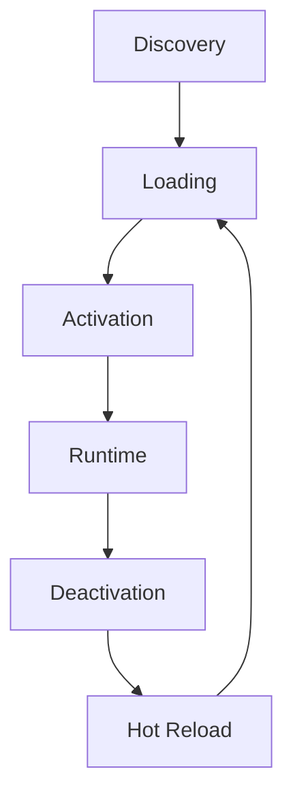

# 🧩 Plugin API Reference

> **XKit v3.0 Plugin Development API**

This document provides comprehensive API reference for developing XKit plugins with hot-reload support and event-driven architecture.

## 🎯 Quick Navigation

| Section | Description |
|---------|-------------|
| [Plugin Lifecycle](#plugin-lifecycle) | Loading, activation, and cleanup |
| [Base Classes](#base-classes) | Core plugin interfaces |
| [Plugin Manager](#plugin-manager) | Dynamic loading and management |
| [Event Integration](#event-integration) | Event-driven communication |
| [Service Access](#service-access) | Using XKit services |
| [Examples](#examples) | Complete plugin examples |

## 🔄 Plugin Lifecycle

XKit plugins follow a structured lifecycle:

1. **Discovery** - Plugin files are discovered in plugin directories
2. **Loading** - Plugin class is instantiated and metadata validated
3. **Activation** - Plugin `load()` method is called, services initialized
4. **Runtime** - Plugin handles events and executes commands
5. **Deactivation** - Plugin `unload()` method is called for cleanup
6. **Hot Reload** - Plugin can be reloaded without restarting XKit



## 📋 Base Classes

### XKitPlugin

Base abstract class for all plugins:

```python
from xkit.plugins.base import XKitPlugin, PluginMetadata
from typing import Dict, List, Any, Optional

class MyPlugin(XKitPlugin):
    def __init__(self):
        # Define plugin metadata
        metadata = PluginMetadata(
            name="my-plugin",
            version="1.0.0",
            description="Example plugin for XKit",
            author="Your Name",
            dependencies=["requests>=2.28.0"],  # Python packages
            provides=["custom-command", "helper-service"],  # Services provided
            requires=["git_service", "display_service"],  # Services required
            hot_reload=True,  # Enable hot reload support
            priority=100  # Loading priority (lower = higher priority)
        )
        super().__init__(metadata)
        
        # Plugin-specific initialization
        self.custom_data = {}
        
    async def load(self) -> None:
        """Called when plugin is loaded/activated"""
        # Initialize services
        self.git_service = self.get_service("git_service")
        self.display_service = self.get_service("display_service")
        
        # Register commands
        self.register_command("my-cmd", self.handle_command)
        self.register_command("my-status", self.handle_status)
        
        # Subscribe to events
        event_bus = self.get_service("event_bus")
        event_bus.subscribe("CommandExecutedEvent", self.on_command_executed)
        
        # Plugin-specific setup
        await self._setup_resources()
        
        self.log_info("Plugin loaded successfully")
    
    async def unload(self) -> None:
        """Called when plugin is unloaded/deactivated"""
        # Cleanup resources
        await self._cleanup_resources()
        
        # Unsubscribe from events (automatic)
        # Unregister commands (automatic)
        
        self.log_info("Plugin unloaded")
    
    def get_health_status(self) -> Dict[str, Any]:
        """Return plugin health status"""
        return {
            "status": "healthy",
            "commands_registered": len(self._commands),
            "events_subscribed": len(self._event_subscriptions),
            "custom_metrics": self.custom_data
        }
    
    async def handle_command(self, args: List[str]) -> str:
        """Handle the my-cmd command"""
        if not args:
            return "Usage: my-cmd <action> [options]"
        
        action = args[0]
        options = args[1:]
        
        if action == "hello":
            name = options[0] if options else "World"
            return f"Hello, {name}! 👋"
        elif action == "info":
            return f"Plugin: {self.metadata.name} v{self.metadata.version}"
        else:
            return f"Unknown action: {action}"
    
    async def handle_status(self, args: List[str]) -> str:
        """Handle the my-status command"""
        status = self.get_health_status()
        return f"Plugin Status: {status['status']}"
    
    async def on_command_executed(self, event):
        """Handle command execution events"""
        command = event.command
        success = event.success
        self.log_info(f"Command executed: {command}, Success: {success}")
    
    async def _setup_resources(self):
        """Plugin-specific resource setup"""
        # Example: Initialize external connections, load data, etc.
        pass
    
    async def _cleanup_resources(self):
        """Plugin-specific resource cleanup"""
        # Example: Close connections, save data, etc.
        pass
```

### PluginMetadata

Plugin metadata definition:

```python
from xkit.plugins.base import PluginMetadata

metadata = PluginMetadata(
    name="git-enhanced",           # Unique plugin identifier
    version="2.1.0",              # Semantic version
    description="Enhanced Git operations with AI assistance",
    author="XKit Team",           # Plugin author
    dependencies=[                # Python package dependencies
        "gitpython>=3.1.0",
        "openai>=1.0.0"
    ],
    provides=[                    # Services this plugin provides
        "git-smart-commit",
        "git-ai-review", 
        "branch-analysis"
    ],
    requires=[                    # Services this plugin requires
        "ai_service",
        "git_service",
        "display_service"
    ],
    hot_reload=True,              # Support hot reloading
    priority=50                   # Loading priority (0-1000, lower = higher)
)
```

## 🔧 Plugin Manager

### Dynamic Loading

The Plugin Manager handles automatic discovery and loading:

```python
from xkit.plugins.manager import PluginManager

# Get plugin manager instance
plugin_manager = container.get_service("plugin_manager")

# Load plugin from file
success = await plugin_manager.load_plugin("/path/to/plugin.py")

# Load all plugins from directory
await plugin_manager.load_directory("/path/to/plugins/")

# Get loaded plugin
plugin = plugin_manager.get_plugin("plugin-name")

# Reload plugin (hot reload)
success = await plugin_manager.reload_plugin("plugin-name")

# Unload plugin
await plugin_manager.unload_plugin("plugin-name")

# List all plugins
plugins = plugin_manager.list_plugins()
for plugin in plugins:
    print(f"📦 {plugin.metadata.name} v{plugin.metadata.version}")
```

### Plugin Discovery

Plugins are automatically discovered in:

- `Scripts/xkit/plugins/` - Core plugins
- `~/.xkit/plugins/` - User plugins  
- `./xkit-plugins/` - Project-specific plugins
- Custom directories via configuration

### Hot Reload Support

```python
# Enable hot reload monitoring
plugin_manager.enable_hot_reload(watch_directories=[
    "Scripts/xkit/plugins/",
    "/custom/plugin/path"
])

# Manual reload
await plugin_manager.reload_plugin("plugin-name")

# Reload all plugins
await plugin_manager.reload_all_plugins()
```

## 📡 Event Integration

### Subscribing to Events

```python
class EventListenerPlugin(XKitPlugin):
    async def load(self):
        event_bus = self.get_service("event_bus")
        
        # Subscribe to specific events
        event_bus.subscribe("CommandExecutedEvent", self.on_command_executed)
        event_bus.subscribe("GitOperationEvent", self.on_git_operation)
        event_bus.subscribe("ErrorOccurredEvent", self.on_error_occurred)
        
        # Subscribe with conditions
        event_bus.subscribe(
            "CommandExecutedEvent",
            self.on_failed_command,
            condition=lambda event: not event.success
        )
        
        # Subscribe to all events (wildcard)
        event_bus.subscribe("*", self.on_any_event)
    
    async def on_command_executed(self, event):
        self.log_info(f"Command executed: {event.command}")
    
    async def on_git_operation(self, event):
        if event.operation == "commit":
            self.display_service.show_success("Commit completed!")
    
    async def on_error_occurred(self, event):
        # Log error for analysis
        await self._log_error_for_analysis(event.error, event.context)
    
    async def on_failed_command(self, event):
        # Provide help for failed commands
        suggestion = await self._suggest_fix(event.command, event.error)
        self.display_service.show_info(f"💡 Suggestion: {suggestion}")
```

### Publishing Events

```python
class EventPublisherPlugin(XKitPlugin):
    async def load(self):
        self.event_bus = self.get_service("event_bus")
        self.register_command("trigger-event", self.trigger_custom_event)
    
    async def trigger_custom_event(self, args: List[str]) -> str:
        # Create custom event
        from xkit.events.events import CustomEvent
        
        event = CustomEvent(
            event_type="plugin-action",
            data={
                "plugin": self.metadata.name,
                "action": "custom_trigger",
                "args": args
            }
        )
        
        # Publish event
        await self.event_bus.publish(event)
        
        return f"Event published: {event.event_type}"
```

## 🛠️ Service Access

### Core Services

Access XKit's core services from your plugin:

```python
class ServiceIntegrationPlugin(XKitPlugin):
    async def load(self):
        # Git operations
        self.git_service = self.get_service("git_service")
        
        # Display/UI
        self.display_service = self.get_service("display_service")
        
        # AI assistance
        self.ai_service = self.get_service("ai_service")
        
        # Configuration
        self.config_service = self.get_service("config_service")
        
        # Event system
        self.event_bus = self.get_service("event_bus")
        
        # MCP client
        self.mcp_client = self.get_service("mcp_client")
    
    async def example_usage(self, args: List[str]) -> str:
        # Use Git service
        status = await self.git_service.get_status()
        
        # Display results
        if status.is_dirty:
            self.display_service.show_warning("Repository has uncommitted changes")
        else:
            self.display_service.show_success("Repository is clean")
        
        # Use AI service
        analysis = await self.ai_service.analyze_repository()
        
        # Get configuration
        theme = self.config_service.get("display.theme", "default")
        
        # Use MCP client
        tools = await self.mcp_client.list_tools("xkit-core")
        
        return f"Analysis complete. Found {len(tools)} MCP tools available."
```

### Providing Services

Plugins can provide services for other plugins:

```python
class ServiceProviderPlugin(XKitPlugin):
    def __init__(self):
        metadata = PluginMetadata(
            name="database-plugin",
            version="1.0.0", 
            description="Database operations service",
            provides=["database_service"]  # Declare provided services
        )
        super().__init__(metadata)
    
    async def load(self):
        # Create service instance
        self.db_service = DatabaseService()
        
        # Register service with container
        container = self.get_service("container")
        container.register_singleton("database_service", self.db_service)
        
        self.log_info("Database service registered")
    
    async def unload(self):
        # Cleanup service
        container = self.get_service("container")
        if container.has_service("database_service"):
            container.unregister_service("database_service")


class DatabaseService:
    """Custom service provided by plugin"""
    
    def __init__(self):
        self.connection = None
    
    async def connect(self, connection_string: str):
        # Implement database connection
        pass
    
    async def execute_query(self, query: str):
        # Implement query execution
        pass
```

## 🚀 Complete Examples

### Git Enhancement Plugin

```python
from xkit.plugins.base import XKitPlugin, PluginMetadata
from typing import List, Dict, Any
import asyncio

class GitEnhancementPlugin(XKitPlugin):
    """Enhanced Git operations with AI assistance"""
    
    def __init__(self):
        metadata = PluginMetadata(
            name="git-enhanced",
            version="1.0.0",
            description="Enhanced Git operations with AI assistance",
            author="XKit Team",
            requires=["git_service", "ai_service", "display_service"],
            provides=["smart-commit", "ai-review"],
            hot_reload=True,
            priority=50
        )
        super().__init__(metadata)
    
    async def load(self):
        # Get required services
        self.git_service = self.get_service("git_service") 
        self.ai_service = self.get_service("ai_service")
        self.display_service = self.get_service("display_service")
        self.event_bus = self.get_service("event_bus")
        
        # Register enhanced commands
        self.register_command("smart-commit", self.smart_commit)
        self.register_command("ai-review", self.ai_review)
        self.register_command("suggest-branch", self.suggest_branch)
        
        # Subscribe to Git events
        self.event_bus.subscribe("GitOperationEvent", self.on_git_operation)
        
        self.log_info("Git Enhancement Plugin loaded")
    
    async def smart_commit(self, args: List[str]) -> str:
        """Create intelligent commit with AI-generated message"""
        try:
            # Get repository status
            status = await self.git_service.get_status()
            
            if not status.staged_files and not status.modified_files:
                return "No changes to commit"
            
            # Stage files if needed
            if status.modified_files and not args:
                # AI suggests which files to stage
                suggestion = await self.ai_service.suggest_files_to_stage(
                    status.modified_files
                )
                files_to_stage = suggestion.get("files", status.modified_files)
            else:
                files_to_stage = args or status.modified_files
            
            # Stage the files
            for file in files_to_stage:
                await self.git_service.add_file(file)
            
            # Generate commit message using AI
            staged_files = await self.git_service.get_staged_files()
            diff = await self.git_service.get_staged_diff()
            
            commit_message = await self.ai_service.generate_commit_message({
                "files": staged_files,
                "diff": diff,
                "branch": status.branch
            })
            
            # Show preview
            self.display_service.show_info(f"📝 Proposed commit message:\n{commit_message}")
            
            # Confirm with user (implement confirmation)
            confirmed = True  # Simplified for example
            
            if confirmed:
                # Perform commit
                result = await self.git_service.commit(commit_message)
                
                if result.success:
                    # Publish event
                    await self.event_bus.publish({
                        "type": "GitOperationEvent",
                        "operation": "smart-commit",
                        "files": staged_files,
                        "message": commit_message
                    })
                    
                    return f"✅ Smart commit completed: {commit_message[:50]}..."
                else:
                    return f"❌ Commit failed: {result.error}"
            else:
                return "Commit cancelled"
                
        except Exception as e:
            self.log_error(f"Smart commit failed: {e}")
            return f"❌ Error: {e}"
    
    async def ai_review(self, args: List[str]) -> str:
        """AI-powered code review"""
        try:
            # Get current diff or specify files
            if args:
                diff = await self.git_service.get_file_diff(args)
            else:
                diff = await self.git_service.get_working_diff()
            
            if not diff:
                return "No changes to review"
            
            # AI analysis
            self.display_service.show_info("🤖 AI is reviewing your code...")
            
            review = await self.ai_service.review_code({
                "diff": diff,
                "language": "auto-detect",
                "focus": ["best-practices", "bugs", "performance"]
            })
            
            # Format review output
            output = ["🔍 AI Code Review Results:", ""]
            
            if review.get("issues"):
                output.append("⚠️  Issues Found:")
                for issue in review["issues"]:
                    output.append(f"  • {issue['severity']}: {issue['message']}")
                    output.append(f"    Line {issue['line']}: {issue['suggestion']}")
                output.append("")
            
            if review.get("improvements"):
                output.append("💡 Suggestions:")
                for improvement in review["improvements"]:
                    output.append(f"  • {improvement}")
                output.append("")
            
            score = review.get("score", "N/A")
            output.append(f"📊 Code Quality Score: {score}/10")
            
            return "\n".join(output)
            
        except Exception as e:
            self.log_error(f"AI review failed: {e}")
            return f"❌ Review failed: {e}"
    
    async def suggest_branch(self, args: List[str]) -> str:
        """Suggest branch name based on changes"""
        try:
            # Get current changes
            status = await self.git_service.get_status()
            diff = await self.git_service.get_working_diff()
            
            # AI suggests branch name
            suggestion = await self.ai_service.suggest_branch_name({
                "modified_files": status.modified_files,
                "diff_summary": diff[:1000],  # First 1000 chars
                "current_branch": status.branch
            })
            
            branch_name = suggestion.get("name", "feature/new-changes")
            description = suggestion.get("description", "")
            
            output = [
                f"🌿 Suggested branch name: {branch_name}",
                f"📝 Description: {description}",
                "",
                "Create this branch? Run: git checkout -b " + branch_name
            ]
            
            return "\n".join(output)
            
        except Exception as e:
            self.log_error(f"Branch suggestion failed: {e}")
            return f"❌ Error: {e}"
    
    async def on_git_operation(self, event):
        """Handle Git operation events"""
        operation = event.get("operation")
        success = event.get("success", True)
        
        if operation == "commit" and success:
            # Celebrate successful commits
            self.display_service.show_success("🎉 Commit successful!")
        elif operation == "push" and success:
            self.display_service.show_success("🚀 Changes pushed!")
```

### Monitoring Plugin

```python
class MonitoringPlugin(XKitPlugin):
    """System monitoring and metrics collection"""
    
    def __init__(self):
        metadata = PluginMetadata(
            name="monitoring",
            version="1.0.0",
            description="System monitoring and performance metrics",
            provides=["metrics-service", "health-check"],
            hot_reload=True
        )
        super().__init__(metadata)
        self.metrics = {}
        self.start_time = None
    
    async def load(self):
        self.start_time = asyncio.get_event_loop().time()
        self.display_service = self.get_service("display_service")
        self.event_bus = self.get_service("event_bus")
        
        # Register commands
        self.register_command("metrics", self.show_metrics)
        self.register_command("health", self.health_check)
        
        # Monitor all events
        self.event_bus.subscribe("*", self.on_any_event)
        
        # Start background monitoring
        asyncio.create_task(self._monitor_loop())
        
        self.log_info("Monitoring plugin started")
    
    async def show_metrics(self, args: List[str]) -> str:
        """Display system metrics"""
        uptime = asyncio.get_event_loop().time() - self.start_time
        
        output = [
            "📊 XKit System Metrics",
            f"⏱️  Uptime: {uptime:.1f}s",
            f"📨 Total Events: {self.metrics.get('total_events', 0)}",
            f"🔧 Commands Executed: {self.metrics.get('commands_executed', 0)}",
            f"⚠️  Errors: {self.metrics.get('errors', 0)}",
            "",
            "🔥 Most Used Commands:"
        ]
        
        # Show top commands
        commands = self.metrics.get("command_usage", {})
        for cmd, count in sorted(commands.items(), key=lambda x: x[1], reverse=True)[:5]:
            output.append(f"  • {cmd}: {count}")
        
        return "\n".join(output)
    
    async def health_check(self, args: List[str]) -> str:
        """System health check"""
        issues = []
        
        # Check core services
        container = self.get_service("container")
        required_services = ["git_service", "display_service", "event_bus"]
        
        for service in required_services:
            if not container.has_service(service):
                issues.append(f"Missing service: {service}")
        
        # Check error rate
        error_rate = self.metrics.get('errors', 0) / max(self.metrics.get('total_events', 1), 1)
        if error_rate > 0.1:  # 10% error rate threshold
            issues.append(f"High error rate: {error_rate:.1%}")
        
        if issues:
            return "⚠️ Health Issues:\n" + "\n".join(f"  • {issue}" for issue in issues)
        else:
            return "✅ All systems healthy"
    
    async def on_any_event(self, event):
        """Track all system events"""
        self.metrics["total_events"] = self.metrics.get("total_events", 0) + 1
        
        event_type = getattr(event, "type", "unknown")
        if event_type == "CommandExecutedEvent":
            self.metrics["commands_executed"] = self.metrics.get("commands_executed", 0) + 1
            
            # Track command usage
            command = getattr(event, "command", "unknown")
            usage = self.metrics.setdefault("command_usage", {})
            usage[command] = usage.get(command, 0) + 1
            
        elif event_type == "ErrorOccurredEvent":
            self.metrics["errors"] = self.metrics.get("errors", 0) + 1
    
    async def _monitor_loop(self):
        """Background monitoring loop"""
        while True:
            try:
                # Collect system metrics every 30 seconds
                await asyncio.sleep(30)
                
                # Add custom monitoring logic here
                # e.g., CPU usage, memory, disk space
                
            except asyncio.CancelledError:
                break
            except Exception as e:
                self.log_error(f"Monitoring loop error: {e}")
```

## 🔧 Testing Plugins

### Unit Testing

```python
import pytest
import asyncio
from unittest.mock import Mock, AsyncMock
from xkit.plugins.manager import PluginManager
from my_plugin import MyPlugin

class TestMyPlugin:
    @pytest.fixture
    def plugin(self):
        plugin = MyPlugin()
        # Mock services
        plugin._services = {
            "git_service": Mock(),
            "display_service": Mock(),
            "ai_service": AsyncMock()
        }
        return plugin
    
    @pytest.mark.asyncio
    async def test_plugin_load(self, plugin):
        await plugin.load()
        assert plugin.status == PluginStatus.ACTIVE
        assert len(plugin._commands) > 0
    
    @pytest.mark.asyncio 
    async def test_command_execution(self, plugin):
        await plugin.load()
        result = await plugin.handle_command(["hello", "XKit"])
        assert "Hello, XKit!" in result
    
    @pytest.mark.asyncio
    async def test_plugin_unload(self, plugin):
        await plugin.load()
        await plugin.unload()
        assert plugin.status == PluginStatus.UNLOADED
```

### Integration Testing

```python
@pytest.mark.asyncio
async def test_plugin_integration():
    # Test with real plugin manager
    plugin_manager = PluginManager()
    
    # Load plugin
    success = await plugin_manager.load_plugin("path/to/my_plugin.py")
    assert success
    
    # Test plugin functionality
    plugin = plugin_manager.get_plugin("my-plugin")
    result = await plugin.handle_command(["test"])
    assert result is not None
    
    # Test hot reload
    success = await plugin_manager.reload_plugin("my-plugin")
    assert success
```

## 🔗 Related Documentation

- **[Core API](core-api.md)** - XKit Core Python API
- **[Event API](event-api.md)** - Event system detailed reference
- **[MCP Protocol](mcp-protocol.md)** - MCP integration guide
- **[Plugin Development Guide](../development/plugin-development.md)** - Step-by-step development guide

---

**Last Updated**: September 2025 | **Version**: v3.0.0  
**💙 Made with love by the XKit Community**