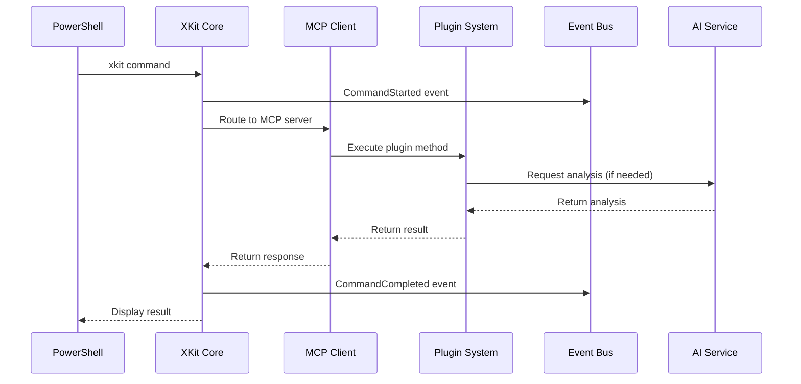
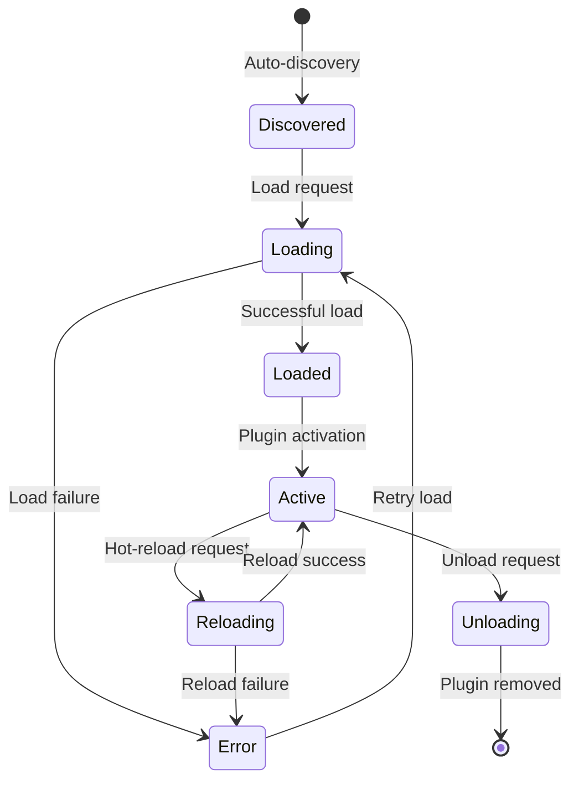

# 🏗️ XKit v3.0 Architecture Overview

> **Deep dive into XKit's Hybrid MCP Architecture**

XKit v3.0 represents a fundamental architectural evolution, combining multiple modern patterns to create a powerful, extensible, and maintainable development framework.

## 🎯 **Architecture Principles**

### **1. Hybrid MCP Architecture**
- **Model Context Protocol** as the primary extension mechanism
- Internal and external MCP servers for maximum flexibility
- Seamless interoperability with the broader MCP ecosystem

### **2. Plugin-First Design**
- Core functionality implemented as plugins
- Hot-reload capabilities without system restart
- Auto-discovery and dependency management

### **3. Event-Driven Communication**
- Central event bus for loose coupling
- Asynchronous message passing
- Event sourcing for auditability

### **4. Hexagonal Architecture**
- Clean separation of concerns
- Ports and adapters pattern
- Testable and maintainable codebase

### **5. AI-First Integration**
- AI capabilities embedded at every layer
- Context-aware intelligent assistance
- Continuous learning and improvement

## 🏛️ **System Architecture**

```
┌─────────────────────────────────────────────────────────────────────┐
│                        XKit v3.0 Hybrid Architecture                │
├─────────────────────────────────────────────────────────────────────┤
│  🔧 PowerShell Layer (Minimal Entry Point)                         │
│  ├── Microsoft.PowerShell_profile.ps1    # Basic profile setup     │
│  ├── xkit-v3.ps1                         # Command dispatcher       │
│  └── oh-my-xkit/                         # Legacy compatibility     │
├─────────────────────────────────────────────────────────────────────┤
│  🐍 Python Core (Business Logic)                                   │
│  ├── xkit_main.py                        # Application bootstrap    │
│  └── xkit/                               # Core modules             │
│      ├── 💎 core/                        # Domain Layer            │
│      │   ├── application.py             # Application services      │
│      │   ├── container.py               # DI container             │
│      │   ├── domain/                    # Business entities        │
│      │   └── ports/                     # Interface contracts      │
│      ├── 🔌 adapters/                   # Infrastructure Layer     │
│      │   ├── cli/                       # Command line interface    │
│      │   ├── external/                  # External service adapters │
│      │   └── web/                       # Web interface (future)    │
│      ├── 🔌 mcp/                        # MCP Integration Layer    │
│      │   ├── client.py                  # MCP client implementation │
│      │   ├── protocol.py                # MCP protocol handlers     │
│      │   ├── config.json                # Server configurations     │
│      │   └── servers/                   # Internal MCP servers      │
│      ├── 🧩 plugins/                    # Plugin System             │
│      │   ├── manager.py                 # Plugin lifecycle manager  │
│      │   ├── loader.py                  # Dynamic plugin loading    │
│      │   ├── registry.py                # Plugin registration       │
│      │   └── core/                      # Essential plugins         │
│      ├── 📡 events/                     # Event System              │
│      │   ├── bus.py                     # Central event bus         │
│      │   ├── events.py                  # Event definitions         │
│      │   └── handlers/                  # Event handlers            │
│      └── 🛠️ infrastructure/             # Infrastructure Services   │
│          ├── ai_service.py              # AI integration            │
│          ├── git.py                     # Git operations            │
│          └── config.py                  # Configuration management  │
└─────────────────────────────────────────────────────────────────────┘
```

## 🔄 **Data Flow Architecture**

### **Command Execution Flow**



### **Plugin Lifecycle**



## 🏗️ **Layer Responsibilities**

### **PowerShell Layer (Presentation)**
- **Responsibility**: Minimal command parsing and delegation
- **Components**: Profile setup, command routing, basic error handling
- **Principle**: Keep it simple - delegate to Python immediately

```powershell
# Example: Minimal PowerShell wrapper
function global:xkit {
    param([Parameter(ValueFromRemainingArguments)]$args)
    python Scripts\xkit_main.py @args
}
```

### **Core Domain (Business Logic)**
- **Responsibility**: Business rules and domain logic
- **Components**: Entities, value objects, domain services
- **Principle**: Pure business logic, no external dependencies

```python
# Example: Domain entity
@dataclass
class XKitContext:
    project_info: ProjectInfo
    mcp_servers: List[MCPServer]
    active_plugins: List[Plugin]
    ai_session: Optional[AISession] = None
```

### **Application Layer (Use Cases)**
- **Responsibility**: Orchestrate domain objects and external services
- **Components**: Application services, use case implementations
- **Principle**: Coordinate between domain and infrastructure

```python
# Example: Application service
class CommandExecutionService:
    def __init__(self, mcp_client: MCPClient, event_bus: EventBus):
        self.mcp_client = mcp_client
        self.event_bus = event_bus
    
    async def execute_command(self, command: Command) -> Result:
        await self.event_bus.publish(CommandStartedEvent(command))
        result = await self.mcp_client.call_tool(command.tool, command.args)
        await self.event_bus.publish(CommandCompletedEvent(command, result))
        return result
```

### **Infrastructure Layer (External Concerns)**
- **Responsibility**: External integrations and technical concerns
- **Components**: Database access, file system, network, AI services
- **Principle**: Implement ports defined by domain layer

```python
# Example: Infrastructure implementation
class GeminiAIService(AIServicePort):
    def __init__(self, api_key: str):
        self.client = genai.GenerativeModel('gemini-2.0-flash')
    
    async def analyze_code(self, code: str, context: str) -> AIAnalysis:
        response = await self.client.generate_content(
            f"Analyze this code in context of {context}: {code}"
        )
        return AIAnalysis(response.text)
```

## 🔌 **MCP Integration Architecture**

### **MCP Server Types**

1. **Internal MCP Servers** - Built-in functionality
   - `xkit-core`: Essential commands and operations
   - `xkit-ai`: AI analysis and generation
   - `xkit-git`: Advanced Git operations
   - `xkit-project`: Project analysis and management

2. **External MCP Servers** - Third-party integrations
   - File system operations
   - Database connections
   - Cloud service integrations
   - Custom business logic

### **MCP Communication Pattern**

```python
# MCP Server Implementation
class XKitCoreMCPServer:
    async def list_tools(self) -> List[Tool]:
        return [
            Tool(name="status", description="System status"),
            Tool(name="health-check", description="Health check"),
        ]
    
    async def call_tool(self, name: str, arguments: dict) -> str:
        if name == "status":
            return await self.get_system_status()
        elif name == "health-check":
            return await self.perform_health_check()
```

## 🧩 **Plugin Architecture**

### **Plugin Interface**

```python
from abc import ABC, abstractmethod

class XKitPlugin(ABC):
    def __init__(self, name: str, version: str):
        self.name = name
        self.version = version
        self.dependencies = []
        self.commands = {}
    
    @abstractmethod
    async def load(self) -> None:
        """Initialize plugin and register commands"""
        pass
    
    @abstractmethod
    async def unload(self) -> None:
        """Cleanup plugin resources"""
        pass
    
    def register_command(self, name: str, handler: callable):
        """Register command handler"""
        self.commands[name] = handler
```

### **Plugin Loading Strategy**

1. **Discovery Phase**: Scan plugin directories
2. **Dependency Resolution**: Resolve plugin dependencies
3. **Loading Phase**: Initialize plugins in dependency order
4. **Registration Phase**: Register commands and event handlers
5. **Activation Phase**: Mark plugins as active

## 📡 **Event System Architecture**

### **Event Bus Implementation**

```python
class EventBus:
    def __init__(self):
        self._handlers = defaultdict(list)
        self._middleware = []
    
    async def publish(self, event: Event) -> None:
        # Apply middleware
        for middleware in self._middleware:
            event = await middleware.process(event)
        
        # Notify handlers
        for handler in self._handlers[type(event)]:
            await handler(event)
    
    def subscribe(self, event_type: Type[Event], handler: callable):
        self._handlers[event_type].append(handler)
```

### **Event Types**

- **Command Events**: CommandStarted, CommandCompleted, CommandFailed
- **Plugin Events**: PluginLoaded, PluginUnloaded, PluginReloaded
- **System Events**: SystemStarted, SystemStopping, HealthCheckCompleted
- **AI Events**: AIAnalysisCompleted, AIGenerationCompleted
- **Git Events**: BranchChanged, CommitCreated, RepositoryCloned

## 🔒 **Security Architecture**

### **Security Principles**

1. **Principle of Least Privilege**: Plugins run with minimal permissions
2. **Input Validation**: All inputs validated at boundaries
3. **Secure Defaults**: Secure configuration by default
4. **Audit Trail**: All operations logged for security auditing

### **Plugin Sandboxing**

```python
class PluginSandbox:
    def __init__(self, plugin: XKitPlugin):
        self.plugin = plugin
        self.allowed_modules = ['os', 'sys', 'json', 'requests']
        self.restricted_functions = ['exec', 'eval', 'open']
    
    async def execute_plugin_method(self, method_name: str, *args):
        # Security checks before execution
        self._validate_plugin_permissions()
        return await getattr(self.plugin, method_name)(*args)
```

## 📊 **Performance Architecture**

### **Performance Strategies**

1. **Lazy Loading**: Load plugins and MCP servers on demand
2. **Caching**: Cache frequently accessed data and results
3. **Async Processing**: Use asyncio for non-blocking operations
4. **Connection Pooling**: Reuse MCP connections
5. **Event Batching**: Batch events for efficiency

### **Performance Metrics**

```python
@dataclass
class PerformanceMetrics:
    startup_time: float
    command_response_time: Dict[str, float]
    memory_usage: int
    plugin_load_time: Dict[str, float]
    mcp_connection_time: Dict[str, float]
```

## 🧪 **Testing Architecture**

### **Testing Strategy**

1. **Unit Tests**: Test individual components in isolation
2. **Integration Tests**: Test component interactions
3. **Plugin Tests**: Test plugin loading and execution
4. **MCP Tests**: Test MCP server communication
5. **End-to-End Tests**: Test complete user workflows

### **Test Organization**

```
tests/
├── unit/
│   ├── core/
│   ├── plugins/
│   ├── mcp/
│   └── events/
├── integration/
│   ├── plugin_integration/
│   ├── mcp_integration/
│   └── event_integration/
└── e2e/
    ├── command_workflows/
    └── plugin_workflows/
```

## 🔮 **Future Architecture Considerations**

### **Planned Enhancements**

1. **Microservices**: Split into independent services
2. **Web Interface**: Browser-based management interface
3. **Clustering**: Multi-node deployment support
4. **GraphQL API**: Modern API interface
5. **Blockchain Integration**: Immutable audit trail

### **Scalability Considerations**

- **Horizontal Scaling**: Multiple XKit instances
- **Load Balancing**: Distribute plugin execution
- **Distributed Events**: Event bus across instances
- **Shared State**: Redis-based state management

---

## 📚 **Related Documentation**

- [MCP Integration Details](mcp-integration.md)
- [Plugin System Guide](plugin-system.md)
- [Event System Reference](event-system.md)
- [Development Guidelines](../development/contributing.md)

---

**Last Updated**: September 2025 | **Version**: v3.0.0-dev