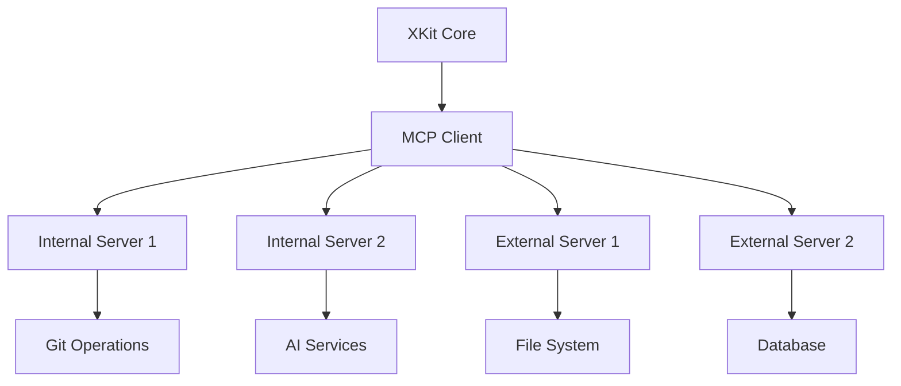

# 🔗 MCP Server Development Guide

> **Complete Guide to Developing MCP Servers for XKit v3.0**

This guide covers everything you need to develop custom MCP (Model Context Protocol) servers that integrate seamlessly with XKit's hybrid architecture.

## 🎯 Quick Navigation

| Section | Description |
|---------|-------------|
| [MCP Basics](#mcp-basics) | Understanding the MCP protocol |
| [Server Architecture](#server-architecture) | How MCP servers work in XKit |
| [Development Setup](#development-setup) | Getting your environment ready |
| [Creating Servers](#creating-servers) | Step-by-step server development |
| [Testing & Debugging](#testing--debugging) | Testing strategies and tools |
| [Deployment](#deployment) | Publishing and distributing servers |

## 🔌 MCP Basics

### What is MCP?

The Model Context Protocol (MCP) is an open standard for connecting AI assistants with external systems. In XKit, MCP servers provide:

- **Extensible Commands**: Add new functionality without modifying core XKit
- **Tool Integration**: Connect with external APIs and services  
- **AI-Friendly Interface**: Structured communication for AI agents
- **Hot-Pluggable**: Start, stop, and reload servers dynamically

### MCP in XKit Architecture



## 🏗️ Server Architecture

### MCP Server Types

#### 1. Internal Servers (Python)
Servers that run within the XKit process:

```python
from xkit.mcp.protocol import MCPServer, Tool, ToolResult

class InternalMCPServer(MCPServer):
    def __init__(self, name: str, version: str):
        super().__init__(name, version)
        # Internal server initialization
```

#### 2. External STDIO Servers
Separate processes communicating via stdin/stdout:

```python
import asyncio
import sys
from mcp import MCPServer

async def main():
    server = MyMCPServer()
    # STDIO communication setup
    await server.run_stdio()

if __name__ == "__main__":
    asyncio.run(main())
```

#### 3. HTTP/WebSocket Servers
Network-based servers for distributed architectures:

```python
from fastapi import FastAPI
from mcp.http import MCPHTTPServer

app = FastAPI()
server = MCPHTTPServer()

@app.post("/mcp")
async def mcp_endpoint(request):
    return await server.handle_request(request)
```

## 🛠️ Development Setup

### Prerequisites

```bash
# Install MCP SDK
pip install model-context-protocol

# Install XKit development tools
pip install xkit-dev  # Hypothetical XKit dev package

# Install testing tools
pip install pytest pytest-asyncio pytest-mock
```

### Project Structure

```
my-mcp-server/
├── src/
│   └── my_server/
│       ├── __init__.py
│       ├── server.py      # Main server implementation
│       ├── tools/         # Tool implementations
│       │   ├── __init__.py
│       │   ├── tool1.py
│       │   └── tool2.py
│       └── utils.py       # Helper functions
├── tests/
│   ├── test_server.py
│   ├── test_tools.py
│   └── conftest.py
├── examples/
│   ├── basic_usage.py
│   └── integration_test.py
├── requirements.txt
├── requirements-dev.txt
├── pyproject.toml
├── README.md
└── server-config.json    # XKit integration config
```

## 🔧 Creating Servers

### Basic Server Implementation

```python
"""
Example MCP Server for file system operations
"""
import asyncio
import os
import json
from pathlib import Path
from typing import List, Dict, Any, Optional

from mcp import MCPServer, Tool, ToolResult
from mcp.types import TextContent, ImageContent


class FileSystemMCPServer(MCPServer):
    """MCP Server providing file system operations"""
    
    def __init__(self):
        super().__init__("filesystem", "1.0.0")
        self.description = "File system operations server"
        self.allowed_paths = [os.getcwd()]  # Security: restrict access
    
    async def list_tools(self) -> List[Tool]:
        """Return available tools"""
        return [
            Tool(
                name="read_file",
                description="Read contents of a text file",
                inputSchema={
                    "type": "object",
                    "properties": {
                        "path": {
                            "type": "string",
                            "description": "Path to the file to read"
                        },
                        "encoding": {
                            "type": "string",
                            "default": "utf-8",
                            "description": "File encoding"
                        }
                    },
                    "required": ["path"]
                }
            ),
            Tool(
                name="write_file",
                description="Write content to a file",
                inputSchema={
                    "type": "object",
                    "properties": {
                        "path": {
                            "type": "string",
                            "description": "Path to the file to write"
                        },
                        "content": {
                            "type": "string",
                            "description": "Content to write to the file"
                        },
                        "encoding": {
                            "type": "string",
                            "default": "utf-8",
                            "description": "File encoding"
                        }
                    },
                    "required": ["path", "content"]
                }
            ),
            Tool(
                name="list_directory",
                description="List contents of a directory",
                inputSchema={
                    "type": "object",
                    "properties": {
                        "path": {
                            "type": "string",
                            "description": "Path to the directory to list"
                        },
                        "include_hidden": {
                            "type": "boolean",
                            "default": False,
                            "description": "Include hidden files/directories"
                        }
                    },
                    "required": ["path"]
                }
            ),
            Tool(
                name="create_directory",
                description="Create a new directory",
                inputSchema={
                    "type": "object",
                    "properties": {
                        "path": {
                            "type": "string",
                            "description": "Path of the directory to create"
                        },
                        "parents": {
                            "type": "boolean",
                            "default": True,
                            "description": "Create parent directories if needed"
                        }
                    },
                    "required": ["path"]
                }
            ),
            Tool(
                name="file_info",
                description="Get information about a file or directory",
                inputSchema={
                    "type": "object",
                    "properties": {
                        "path": {
                            "type": "string",
                            "description": "Path to the file or directory"
                        }
                    },
                    "required": ["path"]
                }
            )
        ]
    
    async def call_tool(self, name: str, arguments: Dict[str, Any]) -> ToolResult:
        """Execute a tool call"""
        try:
            # Security check
            if not self._is_path_allowed(arguments.get("path", "")):
                raise PermissionError(f"Access denied to path: {arguments.get('path')}")
            
            if name == "read_file":
                return await self._read_file(arguments)
            elif name == "write_file":
                return await self._write_file(arguments)
            elif name == "list_directory":
                return await self._list_directory(arguments)
            elif name == "create_directory":
                return await self._create_directory(arguments)
            elif name == "file_info":
                return await self._file_info(arguments)
            else:
                raise ValueError(f"Unknown tool: {name}")
                
        except Exception as e:
            return ToolResult(
                content=[TextContent(type="text", text=f"Error: {str(e)}")],
                isError=True
            )
    
    def _is_path_allowed(self, path: str) -> bool:
        """Check if path access is allowed (security)"""
        try:
            abs_path = os.path.abspath(path)
            return any(
                abs_path.startswith(os.path.abspath(allowed))
                for allowed in self.allowed_paths
            )
        except Exception:
            return False
    
    async def _read_file(self, args: Dict[str, Any]) -> ToolResult:
        """Read file content"""
        path = args["path"]
        encoding = args.get("encoding", "utf-8")
        
        try:
            with open(path, "r", encoding=encoding) as f:
                content = f.read()
            
            return ToolResult(
                content=[TextContent(
                    type="text",
                    text=f"File content of {path}:\n\n{content}"
                )]
            )
        except FileNotFoundError:
            raise FileNotFoundError(f"File not found: {path}")
        except UnicodeDecodeError:
            raise ValueError(f"Cannot decode file {path} with encoding {encoding}")
    
    async def _write_file(self, args: Dict[str, Any]) -> ToolResult:
        """Write content to file"""
        path = args["path"]
        content = args["content"]
        encoding = args.get("encoding", "utf-8")
        
        # Create directory if it doesn't exist
        os.makedirs(os.path.dirname(path), exist_ok=True)
        
        with open(path, "w", encoding=encoding) as f:
            f.write(content)
        
        return ToolResult(
            content=[TextContent(
                type="text",
                text=f"Successfully wrote {len(content)} characters to {path}"
            )]
        )
    
    async def _list_directory(self, args: Dict[str, Any]) -> ToolResult:
        """List directory contents"""
        path = args["path"]
        include_hidden = args.get("include_hidden", False)
        
        if not os.path.isdir(path):
            raise NotADirectoryError(f"Not a directory: {path}")
        
        items = []
        for item in os.listdir(path):
            if not include_hidden and item.startswith("."):
                continue
            
            item_path = os.path.join(path, item)
            item_type = "directory" if os.path.isdir(item_path) else "file"
            
            items.append({
                "name": item,
                "type": item_type,
                "path": item_path
            })
        
        # Sort items: directories first, then files, both alphabetically
        items.sort(key=lambda x: (x["type"] != "directory", x["name"].lower()))
        
        items_text = "\n".join([
            f"{'📁' if item['type'] == 'directory' else '📄'} {item['name']}"
            for item in items
        ])
        
        return ToolResult(
            content=[TextContent(
                type="text",
                text=f"Contents of {path}:\n\n{items_text}\n\nTotal: {len(items)} items"
            )]
        )
    
    async def _create_directory(self, args: Dict[str, Any]) -> ToolResult:
        """Create directory"""
        path = args["path"]
        parents = args.get("parents", True)
        
        try:
            os.makedirs(path, exist_ok=parents)
            return ToolResult(
                content=[TextContent(
                    type="text",
                    text=f"Successfully created directory: {path}"
                )]
            )
        except FileExistsError:
            raise FileExistsError(f"Directory already exists: {path}")
    
    async def _file_info(self, args: Dict[str, Any]) -> ToolResult:
        """Get file/directory information"""
        path = args["path"]
        
        if not os.path.exists(path):
            raise FileNotFoundError(f"Path not found: {path}")
        
        stat = os.stat(path)
        
        info = {
            "path": path,
            "name": os.path.basename(path),
            "type": "directory" if os.path.isdir(path) else "file",
            "size": stat.st_size,
            "modified": stat.st_mtime,
            "permissions": oct(stat.st_mode)[-3:],
            "is_readable": os.access(path, os.R_OK),
            "is_writable": os.access(path, os.W_OK),
            "is_executable": os.access(path, os.X_OK)
        }
        
        info_text = f"""📋 File Information: {path}

📄 Name: {info['name']}
🔗 Type: {info['type']}
📏 Size: {info['size']} bytes
🕐 Modified: {info['modified']}
🔒 Permissions: {info['permissions']}
👁️  Readable: {'✅' if info['is_readable'] else '❌'}
✏️  Writable: {'✅' if info['is_writable'] else '❌'}
⚡ Executable: {'✅' if info['is_executable'] else '❌'}"""
        
        return ToolResult(
            content=[TextContent(type="text", text=info_text)]
        )


# Server factory function
def create_server() -> FileSystemMCPServer:
    """Factory function to create server instance"""
    return FileSystemMCPServer()


# Main entry point for STDIO execution
async def main():
    """Main entry point for running as STDIO server"""
    import sys
    from mcp.server.stdio import stdio_server
    
    server = create_server()
    
    # Run the server using STDIO transport
    async with stdio_server() as (read_stream, write_stream):
        await server.run(
            read_stream, write_stream,
            InitializationOptions(
                server_name=server.name,
                server_version=server.version
            )
        )


if __name__ == "__main__":
    asyncio.run(main())
```

### XKit Integration Configuration

Create `server-config.json` for XKit integration:

```json
{
  "name": "filesystem",
  "version": "1.0.0",
  "description": "File system operations MCP server",
  "type": "stdio",
  "command": "python",
  "args": ["-m", "my_server.server"],
  "env": {
    "PYTHONPATH": "/path/to/my_server"
  },
  "working_directory": "/path/to/my_server",
  "enabled": true,
  "security": {
    "allowed_paths": [
      "/home/user/projects",
      "/tmp"
    ],
    "max_file_size": "10MB"
  },
  "health_check": {
    "tool": "file_info",
    "args": {"path": "."},
    "interval_seconds": 60
  }
}
```

### Advanced Server Features

#### Resource Management

```python
class ResourceAwareMCPServer(MCPServer):
    """MCP Server with resource management"""
    
    def __init__(self):
        super().__init__("resource-server", "1.0.0")
        self._active_operations = {}
        self._resource_limits = {
            "max_concurrent_ops": 10,
            "max_memory_mb": 100,
            "max_file_size_mb": 50
        }
    
    async def call_tool(self, name: str, arguments: Dict[str, Any]) -> ToolResult:
        # Check resource limits
        if len(self._active_operations) >= self._resource_limits["max_concurrent_ops"]:
            raise ResourceError("Maximum concurrent operations exceeded")
        
        operation_id = self._generate_operation_id()
        self._active_operations[operation_id] = {
            "tool": name,
            "start_time": time.time(),
            "memory_start": self._get_memory_usage()
        }
        
        try:
            result = await super().call_tool(name, arguments)
            return result
        finally:
            del self._active_operations[operation_id]
    
    def _get_memory_usage(self) -> float:
        """Get current memory usage in MB"""
        import psutil
        return psutil.Process().memory_info().rss / 1024 / 1024
```

#### Caching and Performance

```python
from functools import lru_cache
import hashlib

class CachedMCPServer(MCPServer):
    """MCP Server with caching capabilities"""
    
    def __init__(self):
        super().__init__("cached-server", "1.0.0")
        self._cache = {}
        self._cache_ttl = {}
        self.cache_duration = 300  # 5 minutes
    
    async def call_tool(self, name: str, arguments: Dict[str, Any]) -> ToolResult:
        # Generate cache key
        cache_key = self._generate_cache_key(name, arguments)
        
        # Check cache
        if self._is_cached(cache_key):
            return self._get_cached_result(cache_key)
        
        # Execute tool
        result = await super().call_tool(name, arguments)
        
        # Cache result if successful
        if not result.isError:
            self._cache_result(cache_key, result)
        
        return result
    
    def _generate_cache_key(self, name: str, arguments: Dict[str, Any]) -> str:
        """Generate cache key from tool name and arguments"""
        data = json.dumps({"tool": name, "args": arguments}, sort_keys=True)
        return hashlib.md5(data.encode()).hexdigest()
    
    def _is_cached(self, key: str) -> bool:
        """Check if result is cached and not expired"""
        if key not in self._cache:
            return False
        
        if key in self._cache_ttl:
            if time.time() - self._cache_ttl[key] > self.cache_duration:
                del self._cache[key]
                del self._cache_ttl[key]
                return False
        
        return True
    
    def _get_cached_result(self, key: str) -> ToolResult:
        """Get cached result"""
        return self._cache[key]
    
    def _cache_result(self, key: str, result: ToolResult) -> None:
        """Cache result"""
        self._cache[key] = result
        self._cache_ttl[key] = time.time()
```

## 🧪 Testing & Debugging

### Unit Testing

```python
import pytest
import asyncio
from unittest.mock import Mock, patch, mock_open
from my_server.server import FileSystemMCPServer


class TestFileSystemMCPServer:
    
    @pytest.fixture
    def server(self):
        return FileSystemMCPServer()
    
    @pytest.mark.asyncio
    async def test_list_tools(self, server):
        """Test tool listing"""
        tools = await server.list_tools()
        
        assert len(tools) == 5
        tool_names = [tool.name for tool in tools]
        assert "read_file" in tool_names
        assert "write_file" in tool_names
        assert "list_directory" in tool_names
    
    @pytest.mark.asyncio
    async def test_read_file_success(self, server):
        """Test successful file reading"""
        test_content = "Hello, World!"
        
        with patch("builtins.open", mock_open(read_data=test_content)):
            result = await server.call_tool("read_file", {"path": "/test/file.txt"})
        
        assert not result.isError
        assert test_content in result.content[0].text
    
    @pytest.mark.asyncio
    async def test_read_file_not_found(self, server):
        """Test file not found error"""
        with patch("builtins.open", side_effect=FileNotFoundError()):
            result = await server.call_tool("read_file", {"path": "/nonexistent.txt"})
        
        assert result.isError
        assert "File not found" in result.content[0].text
    
    @pytest.mark.asyncio
    async def test_security_path_restriction(self, server):
        """Test path access restrictions"""
        # Set restricted paths
        server.allowed_paths = ["/safe/path"]
        
        result = await server.call_tool("read_file", {"path": "/dangerous/path/file.txt"})
        
        assert result.isError
        assert "Access denied" in result.content[0].text
    
    @pytest.mark.asyncio
    async def test_write_file(self, server):
        """Test file writing"""
        with patch("builtins.open", mock_open()) as mock_file:
            with patch("os.makedirs"):
                result = await server.call_tool("write_file", {
                    "path": "/test/output.txt",
                    "content": "Test content"
                })
        
        assert not result.isError
        mock_file.assert_called_once()
        mock_file().write.assert_called_once_with("Test content")
    
    def test_path_security(self, server):
        """Test path security validation"""
        server.allowed_paths = ["/home/user"]
        
        # Allowed path
        assert server._is_path_allowed("/home/user/file.txt")
        
        # Disallowed path
        assert not server._is_path_allowed("/etc/passwd")
        
        # Path traversal attempt
        assert not server._is_path_allowed("/home/user/../../../etc/passwd")
```

### Integration Testing

```python
import pytest
import tempfile
import os
from pathlib import Path


@pytest.mark.integration
class TestFileSystemIntegration:
    
    @pytest.fixture
    def temp_dir(self):
        """Create temporary directory for testing"""
        with tempfile.TemporaryDirectory() as tmpdir:
            yield tmpdir
    
    @pytest.fixture
    def server_with_temp_dir(self, temp_dir):
        """Server configured for temporary directory"""
        server = FileSystemMCPServer()
        server.allowed_paths = [temp_dir]
        return server
    
    @pytest.mark.asyncio
    async def test_full_file_operations(self, server_with_temp_dir, temp_dir):
        """Test complete file operation workflow"""
        server = server_with_temp_dir
        test_file = os.path.join(temp_dir, "test.txt")
        test_content = "Integration test content"
        
        # Write file
        write_result = await server.call_tool("write_file", {
            "path": test_file,
            "content": test_content
        })
        assert not write_result.isError
        
        # Verify file exists
        assert os.path.exists(test_file)
        
        # Read file back
        read_result = await server.call_tool("read_file", {
            "path": test_file
        })
        assert not read_result.isError
        assert test_content in read_result.content[0].text
        
        # Get file info
        info_result = await server.call_tool("file_info", {
            "path": test_file
        })
        assert not info_result.isError
        assert "test.txt" in info_result.content[0].text
        
        # List directory
        list_result = await server.call_tool("list_directory", {
            "path": temp_dir
        })
        assert not list_result.isError
        assert "test.txt" in list_result.content[0].text
    
    @pytest.mark.asyncio
    async def test_directory_operations(self, server_with_temp_dir, temp_dir):
        """Test directory creation and listing"""
        server = server_with_temp_dir
        new_dir = os.path.join(temp_dir, "new_directory")
        
        # Create directory
        create_result = await server.call_tool("create_directory", {
            "path": new_dir
        })
        assert not create_result.isError
        assert os.path.isdir(new_dir)
        
        # List parent directory should show new directory
        list_result = await server.call_tool("list_directory", {
            "path": temp_dir
        })
        assert not list_result.isError
        assert "new_directory" in list_result.content[0].text
        assert "📁" in list_result.content[0].text  # Directory emoji
```

### MCP Protocol Testing

```python
import json
from mcp.protocol import JSONRPCRequest, JSONRPCResponse


class TestMCPProtocol:
    """Test MCP protocol compliance"""
    
    @pytest.mark.asyncio
    async def test_mcp_request_response_format(self, server):
        """Test MCP request/response format compliance"""
        # Simulate MCP request
        request = JSONRPCRequest(
            id="test-1",
            method="tools/call",
            params={
                "name": "read_file",
                "arguments": {"path": "/test/file.txt"}
            }
        )
        
        # Mock file operations
        with patch("builtins.open", mock_open(read_data="test")):
            result = await server.call_tool("read_file", {"path": "/test/file.txt"})
        
        # Verify response format
        assert hasattr(result, 'content')
        assert hasattr(result, 'isError')
        assert isinstance(result.content, list)
        
        # Check content structure
        content = result.content[0]
        assert hasattr(content, 'type')
        assert hasattr(content, 'text')
    
    @pytest.mark.asyncio
    async def test_tool_schema_validation(self, server):
        """Test that tools have proper JSON schemas"""
        tools = await server.list_tools()
        
        for tool in tools:
            # Verify required fields
            assert hasattr(tool, 'name')
            assert hasattr(tool, 'description')
            assert hasattr(tool, 'inputSchema')
            
            # Verify schema structure
            schema = tool.inputSchema
            assert 'type' in schema
            assert schema['type'] == 'object'
            assert 'properties' in schema
            
            # Verify required fields are specified
            if 'required' in schema:
                for required_field in schema['required']:
                    assert required_field in schema['properties']
```

### Performance Testing

```python
import time
import asyncio
import concurrent.futures


@pytest.mark.performance
class TestPerformance:
    
    @pytest.mark.asyncio
    async def test_concurrent_operations(self, server_with_temp_dir, temp_dir):
        """Test server performance under concurrent load"""
        server = server_with_temp_dir
        
        async def create_and_read_file(i):
            """Create and read a file"""
            file_path = os.path.join(temp_dir, f"test_{i}.txt")
            content = f"Test content {i}"
            
            # Write file
            await server.call_tool("write_file", {
                "path": file_path,
                "content": content
            })
            
            # Read file back
            result = await server.call_tool("read_file", {
                "path": file_path
            })
            
            return result
        
        # Test concurrent operations
        start_time = time.time()
        
        tasks = [create_and_read_file(i) for i in range(50)]
        results = await asyncio.gather(*tasks)
        
        end_time = time.time()
        
        # Verify all operations completed successfully
        assert len(results) == 50
        for result in results:
            assert not result.isError
        
        # Performance assertion (adjust based on requirements)
        total_time = end_time - start_time
        assert total_time < 10.0  # Should complete in under 10 seconds
        
        print(f"50 concurrent operations completed in {total_time:.2f} seconds")
    
    @pytest.mark.asyncio
    async def test_memory_usage(self, server):
        """Test memory usage remains reasonable"""
        import psutil
        import gc
        
        process = psutil.Process()
        initial_memory = process.memory_info().rss
        
        # Perform memory-intensive operations
        large_content = "x" * 1024 * 1024  # 1MB string
        
        for i in range(100):
            await server.call_tool("write_file", {
                "path": f"/tmp/test_{i}.txt",
                "content": large_content
            })
        
        # Force garbage collection
        gc.collect()
        
        final_memory = process.memory_info().rss
        memory_increase = final_memory - initial_memory
        
        # Memory increase should be reasonable
        assert memory_increase < 100 * 1024 * 1024  # Less than 100MB increase
```

## 🚀 Deployment

### Packaging for Distribution

Create a proper Python package:

```toml
# pyproject.toml
[build-system]
requires = ["setuptools>=45", "wheel", "setuptools_scm>=6.2"]
build-backend = "setuptools.build_meta"

[project]
name = "xkit-mcp-filesystem"
dynamic = ["version"]
description = "File system MCP server for XKit"
readme = "README.md"
license = {text = "MIT"}
authors = [
    {name = "Your Name", email = "your.email@example.com"}
]
classifiers = [
    "Development Status :: 4 - Beta",
    "Intended Audience :: Developers",
    "License :: OSI Approved :: MIT License",
    "Programming Language :: Python :: 3",
    "Programming Language :: Python :: 3.11",
    "Programming Language :: Python :: 3.12",
    "Framework :: MCP",
    "Framework :: XKit",
]
requires-python = ">=3.11"
dependencies = [
    "model-context-protocol>=0.1.0",
    "pydantic>=2.0.0",
]

[project.optional-dependencies]
dev = [
    "pytest>=7.0.0",
    "pytest-asyncio>=0.21.0",
    "pytest-mock>=3.12.0",
    "black>=22.0.0",
    "isort>=5.10.0",
    "mypy>=1.0.0",
]

[project.scripts]
xkit-mcp-filesystem = "my_server.server:main"

[project.entry-points."xkit.mcp.servers"]
filesystem = "my_server.server:create_server"

[tool.setuptools_scm]
write_to = "src/my_server/_version.py"
```

### Docker Deployment

```dockerfile
# Dockerfile
FROM python:3.11-slim

WORKDIR /app

# Install system dependencies
RUN apt-get update && apt-get install -y \
    git \
    && rm -rf /var/lib/apt/lists/*

# Copy requirements and install Python dependencies
COPY requirements.txt .
RUN pip install --no-cache-dir -r requirements.txt

# Copy application code
COPY src/ ./src/
COPY server-config.json ./

# Create non-root user for security
RUN useradd -m -u 1000 mcpuser && chown -R mcpuser:mcpuser /app
USER mcpuser

# Expose port if using HTTP transport
EXPOSE 8000

# Set environment variables
ENV PYTHONPATH=/app/src
ENV MCP_SERVER_CONFIG=/app/server-config.json

# Health check
HEALTHCHECK --interval=30s --timeout=5s --start-period=5s --retries=3 \
    CMD python -c "import asyncio; from src.my_server.server import create_server; print('healthy')"

# Run server
CMD ["python", "-m", "my_server.server"]
```

### XKit Integration

Add to XKit's MCP configuration:

```json
{
  "servers": {
    "filesystem": {
      "type": "stdio",
      "command": "xkit-mcp-filesystem",
      "description": "File system operations server",
      "enabled": true,
      "security": {
        "sandboxed": true,
        "allowed_paths": ["./", "/tmp"]
      }
    },
    "filesystem-http": {
      "type": "http",
      "url": "http://localhost:8000/mcp",
      "description": "File system server via HTTP",
      "enabled": false,
      "auth": {
        "type": "bearer",
        "token": "${MCP_FILESYSTEM_TOKEN}"
      }
    }
  }
}
```

### GitHub Actions CI/CD

```yaml
# .github/workflows/mcp-server.yml
name: MCP Server CI/CD

on:
  push:
    branches: [ main ]
    tags: [ 'v*' ]
  pull_request:
    branches: [ main ]

jobs:
  test:
    runs-on: ${{ matrix.os }}
    strategy:
      matrix:
        os: [ubuntu-latest, windows-latest, macos-latest]
        python-version: [3.11, 3.12]
    
    steps:
    - uses: actions/checkout@v4
    
    - name: Set up Python ${{ matrix.python-version }}
      uses: actions/setup-python@v4
      with:
        python-version: ${{ matrix.python-version }}
    
    - name: Install dependencies
      run: |
        python -m pip install --upgrade pip
        pip install -e .[dev]
    
    - name: Run tests
      run: pytest tests/ -v --cov=src
    
    - name: Test MCP server startup
      run: |
        timeout 10s python -m my_server.server || true

  publish:
    needs: test
    runs-on: ubuntu-latest
    if: startsWith(github.ref, 'refs/tags/')
    
    steps:
    - uses: actions/checkout@v4
    
    - name: Set up Python
      uses: actions/setup-python@v4
      with:
        python-version: 3.11
    
    - name: Build and publish to PyPI
      env:
        TWINE_USERNAME: __token__
        TWINE_PASSWORD: ${{ secrets.PYPI_TOKEN }}
      run: |
        pip install build twine
        python -m build
        twine upload dist/*
    
    - name: Build and push Docker image
      uses: docker/build-push-action@v4
      with:
        context: .
        push: true
        tags: |
          myregistry/xkit-mcp-filesystem:latest
          myregistry/xkit-mcp-filesystem:${{ github.ref_name }}
```

## 🔗 Related Documentation

- **[MCP Protocol API](../api/mcp-protocol.md)** - XKit MCP integration reference
- **[Official MCP Specification](https://modelcontextprotocol.io/)** - MCP protocol specification
- **[Plugin Development](plugin-development.md)** - Alternative extension method via plugins

---

**Last Updated**: September 2025 | **Version**: v3.0.0  
**💙 Made with love by the XKit Community**