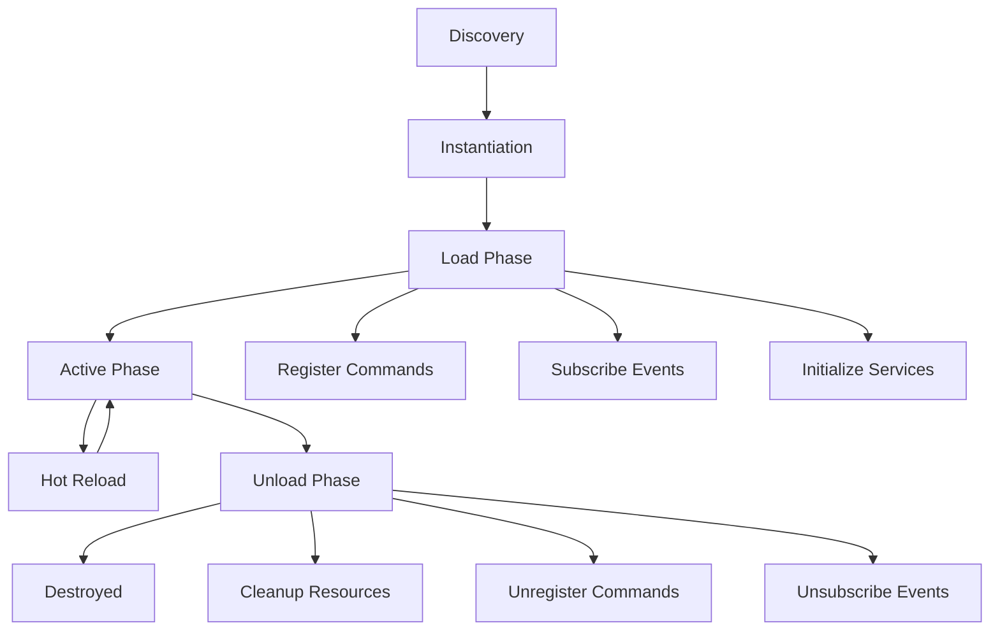

# 🧩 Plugin Development Guide

> **Complete Guide to Developing XKit v3.0 Plugins**

This comprehensive guide covers everything you need to know to create powerful, extensible plugins for XKit's hybrid MCP architecture.

## 🎯 Quick Navigation

| Section | Description |
|---------|-------------|
| [Getting Started](#getting-started) | Plugin basics and first plugin |
| [Plugin Architecture](#plugin-architecture) | Understanding the plugin system |
| [Development Workflow](#development-workflow) | Step-by-step development process |
| [Best Practices](#best-practices) | Coding standards and patterns |
| [Testing Plugins](#testing-plugins) | Testing strategies and tools |
| [Publishing Plugins](#publishing-plugins) | Sharing your plugins |

## 🚀 Getting Started

### Prerequisites

Before developing XKit plugins, ensure you have:

- **Python 3.11+** with typing support
- **XKit v3.0** installed and working
- **Development tools**: VS Code, PyCharm, or similar
- **Git** for version control
- **Basic knowledge** of Python async programming

### Your First Plugin

Let's create a simple "Hello World" plugin:

#### 1. Plugin Structure

Create a new Python file `hello_plugin.py`:

```python
"""
Hello World Plugin for XKit v3.0
A simple example demonstrating plugin development basics
"""
import asyncio
from typing import List, Dict, Any
from datetime import datetime

from xkit.plugins.base import XKitPlugin, PluginMetadata, PluginStatus
from xkit.events.events import XKitEvent


class HelloWorldPlugin(XKitPlugin):
    """Simple Hello World plugin demonstrating XKit plugin basics"""
    
    def __init__(self):
        # Define plugin metadata
        metadata = PluginMetadata(
            name="hello-world",
            version="1.0.0",
            description="Simple Hello World plugin for XKit",
            author="Your Name <your.email@example.com>",
            dependencies=[],  # No external dependencies
            provides=["hello", "greet", "time"],  # Commands this plugin provides
            requires=["display_service"],  # Services this plugin needs
            hot_reload=True,  # Enable hot reload
            priority=100  # Default priority
        )
        super().__init__(metadata)
        
        # Plugin-specific state
        self.greeting_count = 0
        self.start_time = None
    
    async def load(self) -> None:
        """Called when plugin is loaded/activated"""
        # Record start time
        self.start_time = datetime.now()
        
        # Get required services
        self.display_service = self.get_service("display_service")
        
        # Register commands
        self.register_command("hello", self.hello_command)
        self.register_command("greet", self.greet_command)
        self.register_command("time", self.time_command)
        
        # Subscribe to events (optional)
        event_bus = self.get_service("event_bus")
        event_bus.subscribe("CommandExecutedEvent", self.on_command_executed)
        
        self.log_info(f"Hello World plugin loaded! 🌟")
    
    async def unload(self) -> None:
        """Called when plugin is unloaded"""
        self.log_info(f"Hello World plugin unloaded. Served {self.greeting_count} greetings! 👋")
    
    async def hello_command(self, args: List[str]) -> str:
        """Simple hello command"""
        self.greeting_count += 1
        
        if not args:
            return "Hello from XKit! 👋"
        
        name = " ".join(args)
        return f"Hello, {name}! 👋 (Greeting #{self.greeting_count})"
    
    async def greet_command(self, args: List[str]) -> str:
        """More sophisticated greeting command"""
        self.greeting_count += 1
        
        # Parse arguments
        if not args:
            return "Usage: greet <name> [--formal|--casual] [--language <lang>]"
        
        name = args[0]
        style = "casual"
        language = "en"
        
        # Parse options
        if "--formal" in args:
            style = "formal"
        elif "--casual" in args:
            style = "casual"
        
        if "--language" in args:
            lang_index = args.index("--language")
            if lang_index + 1 < len(args):
                language = args[lang_index + 1]
        
        # Generate greeting based on style and language
        greeting = self._generate_greeting(name, style, language)
        
        # Use display service for rich output
        self.display_service.show_success(f"Greeting delivered! 🎉")
        
        return greeting
    
    async def time_command(self, args: List[str]) -> str:
        """Show plugin uptime and current time"""
        current_time = datetime.now()
        uptime = current_time - self.start_time if self.start_time else "Unknown"
        
        return f"""⏰ Time Information:
Current Time: {current_time.strftime('%Y-%m-%d %H:%M:%S')}
Plugin Uptime: {uptime}
Greetings Served: {self.greeting_count}"""
    
    def _generate_greeting(self, name: str, style: str, language: str) -> str:
        """Generate greeting based on parameters"""
        greetings = {
            "en": {
                "formal": f"Good day, {name}. It's a pleasure to meet you.",
                "casual": f"Hey {name}! What's up? 😊"
            },
            "es": {
                "formal": f"Buenos días, {name}. Es un placer conocerle.",
                "casual": f"¡Hola {name}! ¿Qué tal? 😊"
            },
            "fr": {
                "formal": f"Bonjour, {name}. C'est un plaisir de vous rencontrer.",
                "casual": f"Salut {name}! Comment ça va? 😊"
            }
        }
        
        lang_greetings = greetings.get(language, greetings["en"])
        return lang_greetings.get(style, lang_greetings["casual"])
    
    async def on_command_executed(self, event: XKitEvent):
        """Handle command execution events"""
        if hasattr(event, 'command') and event.command.startswith('hello'):
            self.log_info(f"Hello-related command executed: {event.command}")
    
    def get_health_status(self) -> Dict[str, Any]:
        """Return plugin health status"""
        return {
            "status": "healthy",
            "uptime": str(datetime.now() - self.start_time) if self.start_time else "Unknown",
            "greetings_served": self.greeting_count,
            "commands_registered": len(self._commands),
            "memory_usage": "minimal"
        }


# Plugin factory function (optional but recommended)
def create_plugin() -> HelloWorldPlugin:
    """Factory function to create plugin instance"""
    return HelloWorldPlugin()


# Plugin information for discovery
PLUGIN_INFO = {
    "name": "hello-world",
    "version": "1.0.0", 
    "description": "Simple Hello World plugin",
    "entry_point": "create_plugin"
}
```

#### 2. Testing Your Plugin

Create a test file `test_hello_plugin.py`:

```python
"""
Tests for Hello World Plugin
"""
import pytest
import asyncio
from unittest.mock import Mock, AsyncMock
from hello_plugin import HelloWorldPlugin


class TestHelloWorldPlugin:
    
    @pytest.fixture
    def plugin(self):
        """Create plugin instance with mocked services"""
        plugin = HelloWorldPlugin()
        
        # Mock services
        plugin._services = {
            "display_service": Mock(),
            "event_bus": Mock()
        }
        
        return plugin
    
    @pytest.mark.asyncio
    async def test_plugin_load(self, plugin):
        """Test plugin loading"""
        await plugin.load()
        
        assert plugin.status == PluginStatus.LOADED
        assert plugin.start_time is not None
        assert len(plugin._commands) == 3
        assert "hello" in plugin._commands
        assert "greet" in plugin._commands
        assert "time" in plugin._commands
    
    @pytest.mark.asyncio
    async def test_hello_command(self, plugin):
        """Test hello command"""
        await plugin.load()
        
        # Test basic hello
        result = await plugin.hello_command([])
        assert "Hello from XKit!" in result
        assert plugin.greeting_count == 1
        
        # Test hello with name
        result = await plugin.hello_command(["Alice"])
        assert "Hello, Alice!" in result
        assert "#2" in result
        assert plugin.greeting_count == 2
    
    @pytest.mark.asyncio
    async def test_greet_command(self, plugin):
        """Test greet command"""
        await plugin.load()
        
        # Test formal greeting
        result = await plugin.greet_command(["Bob", "--formal"])
        assert "Good day, Bob" in result
        
        # Test casual greeting with language
        result = await plugin.greet_command(["Alice", "--casual", "--language", "es"])
        assert "¡Hola Alice!" in result
    
    @pytest.mark.asyncio
    async def test_time_command(self, plugin):
        """Test time command"""
        await plugin.load()
        
        result = await plugin.time_command([])
        assert "Current Time:" in result
        assert "Plugin Uptime:" in result
        assert "Greetings Served:" in result
    
    def test_health_status(self, plugin):
        """Test health status reporting"""
        status = plugin.get_health_status()
        
        assert status["status"] == "healthy"
        assert "greetings_served" in status
        assert "uptime" in status
    
    @pytest.mark.asyncio
    async def test_plugin_unload(self, plugin):
        """Test plugin unloading"""
        await plugin.load()
        initial_count = plugin.greeting_count
        
        await plugin.unload()
        # Plugin should maintain state until fully destroyed
        assert plugin.greeting_count == initial_count


# Run tests
if __name__ == "__main__":
    pytest.main([__file__])
```

#### 3. Installing and Using Your Plugin

```python
# Method 1: Load via plugin manager
from xkit.plugins.manager import PluginManager

plugin_manager = container.get_service("plugin_manager")
await plugin_manager.load_plugin("path/to/hello_plugin.py")

# Method 2: Direct loading (for testing)
plugin = HelloWorldPlugin()
await plugin.load()

# Use commands
result = await plugin.hello_command(["World"])
print(result)  # "Hello, World! 👋"
```

## 🏗️ Plugin Architecture

### Plugin Lifecycle

Understanding the plugin lifecycle is crucial for proper plugin development:



### Core Components

#### PluginMetadata

Defines essential plugin information:

```python
metadata = PluginMetadata(
    name="my-awesome-plugin",           # Unique identifier
    version="1.2.3",                   # Semantic versioning
    description="Does awesome things",   # Brief description
    author="Developer Name",            # Author information
    dependencies=[                      # Python dependencies
        "requests>=2.28.0",
        "pydantic>=1.10.0"
    ],
    provides=[                          # Services/commands provided
        "awesome-command",
        "super-feature",
        "helper-service"
    ],
    requires=[                          # Required XKit services
        "git_service",
        "ai_service",
        "display_service"
    ],
    hot_reload=True,                    # Hot reload support
    priority=50                         # Loading priority (0-1000)
)
```

#### Service Access

Plugins access XKit services through the service container:

```python
class MyPlugin(XKitPlugin):
    async def load(self):
        # Core services
        self.display = self.get_service("display_service")
        self.git = self.get_service("git_service")
        self.ai = self.get_service("ai_service")
        self.config = self.get_service("config_service")
        self.events = self.get_service("event_bus")
        self.mcp = self.get_service("mcp_client")
        
        # Check if optional service exists
        if self.has_service("database_service"):
            self.db = self.get_service("database_service")
        
        # Custom service injection
        container = self.get_service("container")
        my_service = MyCustomService()
        container.register_singleton("my_service", my_service)
```

#### Command Registration

Register commands that users can execute:

```python
class CommandExamplePlugin(XKitPlugin):
    async def load(self):
        # Simple command
        self.register_command("simple", self.simple_handler)
        
        # Command with validation
        self.register_command(
            "validated", 
            self.validated_handler,
            validator=self.validate_args
        )
        
        # Command with help
        self.register_command(
            "documented",
            self.documented_handler,
            help_text="This command does amazing things"
        )
    
    async def simple_handler(self, args: List[str]) -> str:
        return f"Simple command executed with args: {args}"
    
    async def validated_handler(self, args: List[str]) -> str:
        # Validation already passed
        return f"Validated command with {len(args)} arguments"
    
    def validate_args(self, args: List[str]) -> bool:
        """Validate command arguments"""
        return len(args) >= 1  # At least one argument required
    
    async def documented_handler(self, args: List[str]) -> str:
        """
        Documented command handler
        
        Args:
            args: Command arguments from user
            
        Returns:
            Command result message
        """
        return "Documented command executed"
```

#### Event Integration

Plugins can publish and subscribe to events:

```python
class EventExamplePlugin(XKitPlugin):
    async def load(self):
        self.event_bus = self.get_service("event_bus")
        
        # Subscribe to system events
        self.event_bus.subscribe("CommandExecutedEvent", self.on_command)
        self.event_bus.subscribe("GitOperationEvent", self.on_git_operation)
        self.event_bus.subscribe("ErrorOccurredEvent", self.on_error)
        
        # Subscribe with conditions
        self.event_bus.subscribe(
            "CommandExecutedEvent",
            self.on_failed_command,
            condition=lambda e: not e.success
        )
        
        # Custom event subscription
        self.event_bus.subscribe("my-custom-event", self.on_custom_event)
    
    async def on_command(self, event):
        """Handle any command execution"""
        self.log_info(f"Command executed: {event.command}")
    
    async def on_git_operation(self, event):
        """Handle Git operations"""
        if event.operation == "commit":
            # Publish custom event
            await self.event_bus.publish(XKitEvent(
                event_type="commit-detected",
                data={
                    "branch": event.branch,
                    "message": event.details.get("message"),
                    "plugin": self.metadata.name
                }
            ))
    
    async def on_error(self, event):
        """Handle system errors"""
        # Log error for analysis
        await self._analyze_error(event.error_message, event.context)
    
    async def on_failed_command(self, event):
        """Handle failed commands specifically"""
        suggestion = await self._suggest_fix(event.command, event.error)
        self.display.show_info(f"💡 Try: {suggestion}")
```

## 🛠️ Development Workflow

### Step-by-Step Development Process

#### 1. Planning Phase

Before writing code, plan your plugin:

```python
# plugin_plan.md

## Plugin Name: Git Workflow Enhancer

### Purpose
Enhance Git workflow with AI-powered insights and automation

### Features
- Smart branch naming suggestions
- Automated commit message generation  
- Merge conflict resolution assistance
- Repository health analysis

### Dependencies
- GitPython for Git operations
- OpenAI API for AI features
- Rich for enhanced display

### Integration Points
- Git service for operations
- AI service for intelligence
- Event system for notifications
- MCP for extensible commands

### Commands to Provide
- `smart-branch` - AI branch name suggestions
- `auto-commit` - Automated commit with AI message
- `resolve-conflicts` - Guided conflict resolution
- `repo-health` - Repository analysis

### Events to Handle
- GitOperationEvent (for monitoring)
- CommandExecutedEvent (for statistics)

### Configuration
- AI provider settings
- Git preferences
- Automation levels
```

#### 2. Setup Development Environment

Create a structured development environment:

```bash
# Create plugin directory
mkdir xkit-plugin-git-enhancer
cd xkit-plugin-git-enhancer

# Create Python virtual environment
python -m venv venv
source venv/bin/activate  # or venv\Scripts\activate on Windows

# Install development dependencies
pip install pytest pytest-asyncio black isort mypy
pip install xkit-dev  # Hypothetical XKit development tools

# Create directory structure
mkdir -p {src,tests,docs,examples}
touch src/git_enhancer_plugin.py
touch tests/test_git_enhancer.py
touch docs/README.md
touch examples/usage_example.py
```

#### 3. Implement Plugin Base

Start with the plugin skeleton:

```python
# src/git_enhancer_plugin.py

"""
Git Workflow Enhancer Plugin
Enhances Git operations with AI-powered insights and automation
"""

import asyncio
from typing import List, Dict, Any, Optional
from pathlib import Path

from xkit.plugins.base import XKitPlugin, PluginMetadata
from xkit.events.events import GitOperationEvent, CommandExecutedEvent


class GitEnhancerPlugin(XKitPlugin):
    """Enhanced Git operations with AI assistance"""
    
    def __init__(self):
        metadata = PluginMetadata(
            name="git-enhancer",
            version="1.0.0",
            description="Enhanced Git operations with AI assistance",
            author="Your Name <email@example.com>",
            dependencies=[
                "gitpython>=3.1.0",
                "openai>=1.0.0"
            ],
            provides=[
                "smart-branch",
                "auto-commit", 
                "resolve-conflicts",
                "repo-health"
            ],
            requires=[
                "git_service",
                "ai_service",
                "display_service"
            ],
            hot_reload=True,
            priority=60
        )
        super().__init__(metadata)
        
        # Plugin state
        self.stats = {
            "branches_created": 0,
            "commits_automated": 0,
            "conflicts_resolved": 0
        }
    
    async def load(self) -> None:
        """Initialize plugin"""
        # Get services
        self.git = self.get_service("git_service")
        self.ai = self.get_service("ai_service")
        self.display = self.get_service("display_service")
        self.events = self.get_service("event_bus")
        
        # Register commands
        self.register_command("smart-branch", self.smart_branch_command)
        self.register_command("auto-commit", self.auto_commit_command)
        self.register_command("resolve-conflicts", self.resolve_conflicts_command)
        self.register_command("repo-health", self.repo_health_command)
        
        # Subscribe to events
        self.events.subscribe("GitOperationEvent", self.on_git_operation)
        
        self.log_info("Git Enhancer Plugin loaded successfully! 🚀")
    
    async def unload(self) -> None:
        """Cleanup plugin"""
        self.log_info(f"Git Enhancer unloaded. Stats: {self.stats}")
    
    # Command implementations
    async def smart_branch_command(self, args: List[str]) -> str:
        """AI-powered smart branch creation"""
        # Implementation here
        pass
    
    async def auto_commit_command(self, args: List[str]) -> str:
        """Automated commit with AI-generated message"""
        # Implementation here
        pass
    
    async def resolve_conflicts_command(self, args: List[str]) -> str:
        """Guided conflict resolution"""
        # Implementation here
        pass
    
    async def repo_health_command(self, args: List[str]) -> str:
        """Repository health analysis"""
        # Implementation here
        pass
    
    async def on_git_operation(self, event: GitOperationEvent):
        """Handle Git operation events"""
        if event.success:
            self.log_info(f"Git operation completed: {event.operation}")
            
            # Update statistics
            if event.operation == "commit":
                self.stats["commits_automated"] += 1
```

#### 4. Implement Core Features

Add the actual functionality:

```python
# Continue in git_enhancer_plugin.py

async def smart_branch_command(self, args: List[str]) -> str:
    """AI-powered smart branch creation"""
    try:
        # Get current repository status
        repo_status = await self.git.get_status()
        current_branch = repo_status.branch
        
        # Get recent changes for context
        changes = await self.git.get_working_diff()
        recent_commits = await self.git.get_recent_commits(5)
        
        # AI analysis for branch naming
        ai_request = {
            "task": "suggest_branch_name",
            "context": {
                "current_branch": current_branch,
                "changes": changes[:1000],  # Limit size
                "recent_commits": [c.message for c in recent_commits]
            },
            "requirements": {
                "format": "feature/description" if "feat" in changes.lower() else "fix/description",
                "max_length": 50,
                "use_conventional": True
            }
        }
        
        suggestion = await self.ai.analyze(ai_request)
        suggested_name = suggestion.get("branch_name", "feature/new-feature")
        description = suggestion.get("description", "")
        
        # Create branch if user confirms
        if "--create" in args or "--yes" in args:
            success = await self.git.create_branch(suggested_name)
            if success:
                self.stats["branches_created"] += 1
                
                # Publish event
                await self.events.publish(GitOperationEvent(
                    operation="branch_created",
                    branch=suggested_name,
                    success=True,
                    details={"automated": True, "plugin": "git-enhancer"}
                ))
                
                return f"✅ Created branch: {suggested_name}"
            else:
                return f"❌ Failed to create branch: {suggested_name}"
        else:
            return f"""🌿 Suggested branch name: {suggested_name}
📝 Description: {description}

To create: git checkout -b {suggested_name}
Or run: xkit smart-branch --create"""
    
    except Exception as e:
        self.log_error(f"Smart branch command failed: {e}")
        return f"❌ Error: {str(e)}"

async def auto_commit_command(self, args: List[str]) -> str:
    """Automated commit with AI-generated message"""
    try:
        # Check for staged changes
        staged_files = await self.git.get_staged_files()
        if not staged_files:
            # Auto-stage modified files if requested
            if "--stage" in args:
                modified_files = await self.git.get_modified_files()
                for file in modified_files:
                    await self.git.add_file(file)
                staged_files = await self.git.get_staged_files()
            
            if not staged_files:
                return "No staged changes to commit. Use --stage to auto-stage modified files."
        
        # Get diff for AI analysis
        staged_diff = await self.git.get_staged_diff()
        
        # Generate commit message with AI
        ai_request = {
            "task": "generate_commit_message",
            "context": {
                "diff": staged_diff,
                "files": staged_files,
                "style": "conventional" if "--conventional" in args else "descriptive"
            }
        }
        
        result = await self.ai.analyze(ai_request)
        commit_message = result.get("message", "Update files")
        confidence = result.get("confidence", 0.5)
        
        # Show preview
        preview = f"""📝 Generated commit message:
{commit_message}

🎯 Confidence: {confidence:.1%}
📁 Files: {len(staged_files)} staged
"""
        
        if confidence < 0.7 and "--force" not in args:
            preview += "\n⚠️  Low confidence. Review carefully or use --force"
            return preview
        
        # Commit if confirmed
        if "--yes" in args or confidence > 0.8:
            success = await self.git.commit(commit_message)
            if success:
                self.stats["commits_automated"] += 1
                
                # Publish event
                await self.events.publish(GitOperationEvent(
                    operation="commit",
                    branch=await self.git.get_current_branch(),
                    success=True,
                    details={
                        "message": commit_message,
                        "automated": True,
                        "confidence": confidence
                    }
                ))
                
                return f"✅ Committed: {commit_message}"
            else:
                return "❌ Commit failed"
        else:
            return preview + "\n\nUse --yes to commit automatically"
    
    except Exception as e:
        self.log_error(f"Auto commit failed: {e}")
        return f"❌ Error: {str(e)}"
```

#### 5. Add Tests

Comprehensive testing ensures reliability:

```python
# tests/test_git_enhancer.py

import pytest
import asyncio
from unittest.mock import Mock, AsyncMock, patch
from src.git_enhancer_plugin import GitEnhancerPlugin


class TestGitEnhancerPlugin:
    
    @pytest.fixture
    def mock_services(self):
        """Create mock services"""
        return {
            "git_service": AsyncMock(),
            "ai_service": AsyncMock(),
            "display_service": Mock(),
            "event_bus": AsyncMock()
        }
    
    @pytest.fixture
    def plugin(self, mock_services):
        """Create plugin with mocked services"""
        plugin = GitEnhancerPlugin()
        plugin._services = mock_services
        return plugin
    
    @pytest.mark.asyncio
    async def test_plugin_load(self, plugin):
        """Test plugin loading"""
        await plugin.load()
        
        assert len(plugin._commands) == 4
        assert "smart-branch" in plugin._commands
        assert plugin.stats["branches_created"] == 0
    
    @pytest.mark.asyncio
    async def test_smart_branch_suggestion(self, plugin, mock_services):
        """Test smart branch name suggestion"""
        await plugin.load()
        
        # Mock service responses
        mock_services["git_service"].get_status.return_value = Mock(branch="main")
        mock_services["git_service"].get_working_diff.return_value = "feat: add new feature"
        mock_services["ai_service"].analyze.return_value = {
            "branch_name": "feature/new-feature",
            "description": "Add new feature functionality"
        }
        
        result = await plugin.smart_branch_command([])
        
        assert "feature/new-feature" in result
        assert "Suggested branch name" in result
        mock_services["ai_service"].analyze.assert_called_once()
    
    @pytest.mark.asyncio
    async def test_auto_commit_with_staged_files(self, plugin, mock_services):
        """Test auto commit with staged files"""
        await plugin.load()
        
        # Mock staged files exist
        mock_services["git_service"].get_staged_files.return_value = ["file1.py", "file2.py"]
        mock_services["git_service"].get_staged_diff.return_value = "Some changes"
        mock_services["ai_service"].analyze.return_value = {
            "message": "feat: add new functionality",
            "confidence": 0.9
        }
        mock_services["git_service"].commit.return_value = True
        mock_services["git_service"].get_current_branch.return_value = "main"
        
        result = await plugin.auto_commit_command(["--yes"])
        
        assert "✅ Committed" in result
        assert plugin.stats["commits_automated"] == 1
        mock_services["git_service"].commit.assert_called_once_with("feat: add new functionality")
    
    @pytest.mark.asyncio
    async def test_auto_commit_no_staged_files(self, plugin, mock_services):
        """Test auto commit with no staged files"""
        await plugin.load()
        
        mock_services["git_service"].get_staged_files.return_value = []
        
        result = await plugin.auto_commit_command([])
        
        assert "No staged changes" in result
        mock_services["git_service"].commit.assert_not_called()
    
    @pytest.mark.asyncio
    async def test_event_handling(self, plugin, mock_services):
        """Test Git operation event handling"""
        await plugin.load()
        
        # Simulate Git operation event
        event = Mock()
        event.success = True
        event.operation = "commit"
        
        await plugin.on_git_operation(event)
        
        assert plugin.stats["commits_automated"] == 1
    
    @pytest.mark.asyncio
    async def test_error_handling(self, plugin, mock_services):
        """Test error handling in commands"""
        await plugin.load()
        
        # Make service throw exception
        mock_services["git_service"].get_status.side_effect = Exception("Git error")
        
        result = await plugin.smart_branch_command([])
        
        assert "❌ Error" in result
        assert "Git error" in result


# Integration tests
class TestGitEnhancerIntegration:
    
    @pytest.mark.integration
    @pytest.mark.asyncio
    async def test_with_real_git_repo(self, tmp_path):
        """Test plugin with real Git repository"""
        # Create temporary Git repo
        import subprocess
        
        subprocess.run(["git", "init"], cwd=tmp_path, check=True)
        subprocess.run(["git", "config", "user.email", "test@example.com"], cwd=tmp_path)
        subprocess.run(["git", "config", "user.name", "Test User"], cwd=tmp_path)
        
        # Create test file
        test_file = tmp_path / "test.txt"
        test_file.write_text("Hello World")
        
        subprocess.run(["git", "add", "test.txt"], cwd=tmp_path, check=True)
        subprocess.run(["git", "commit", "-m", "Initial commit"], cwd=tmp_path, check=True)
        
        # Test plugin with real repo
        plugin = GitEnhancerPlugin()
        # Configure plugin to use tmp_path as working directory
        # ... implementation specific to your Git service
```

#### 6. Documentation

Create comprehensive documentation:

```markdown
# Git Enhancer Plugin

Enhanced Git operations with AI assistance for XKit v3.0.

## Features

- **Smart Branch Naming**: AI-powered branch name suggestions based on your changes
- **Auto Commit**: Automated commit message generation using AI
- **Conflict Resolution**: Guided merge conflict resolution
- **Repository Health**: Comprehensive repository analysis

## Installation

```bash
# Via XKit Plugin Manager
xkit plugin-load git-enhancer

# Manual installation
git clone https://github.com/username/xkit-git-enhancer.git
cd xkit-git-enhancer
pip install -r requirements.txt
```

## Commands

### `smart-branch`

Generate AI-powered branch name suggestions.

```bash
# Get suggestion
xkit smart-branch

# Create branch immediately  
xkit smart-branch --create

# Auto-confirm creation
xkit smart-branch --yes
```

### `auto-commit`

Automated commit with AI-generated messages.

```bash
# Generate and preview commit message
xkit auto-commit

# Auto-stage and commit
xkit auto-commit --stage --yes

# Use conventional commit format
xkit auto-commit --conventional
```

## Configuration

Add to your XKit configuration:

```json
{
  "plugins": {
    "git-enhancer": {
      "ai_provider": "openai",
      "commit_style": "conventional",
      "auto_stage": false,
      "confidence_threshold": 0.7
    }
  }
}
```

## Contributing

See [CONTRIBUTING.md](CONTRIBUTING.md) for development guidelines.
```

## 📏 Best Practices

### Code Quality

#### Type Hints and Documentation

```python
from typing import List, Dict, Any, Optional, Union
from dataclasses import dataclass

@dataclass
class CommandResult:
    """Result of a command execution"""
    success: bool
    message: str
    data: Optional[Dict[str, Any]] = None
    error: Optional[Exception] = None


class MyPlugin(XKitPlugin):
    """
    My awesome plugin for XKit
    
    This plugin provides enhanced functionality for...
    """
    
    async def my_command(self, args: List[str]) -> CommandResult:
        """
        Execute my awesome command
        
        Args:
            args: Command line arguments from user
            
        Returns:
            CommandResult with execution status and data
            
        Raises:
            ValueError: If arguments are invalid
            RuntimeError: If command execution fails
        """
        try:
            # Validate arguments
            if len(args) < 1:
                raise ValueError("At least one argument required")
            
            # Process command
            result_data = await self._process_command(args)
            
            return CommandResult(
                success=True,
                message="Command executed successfully",
                data=result_data
            )
            
        except Exception as e:
            self.log_error(f"Command failed: {e}")
            return CommandResult(
                success=False,
                message=f"Command failed: {str(e)}",
                error=e
            )
    
    async def _process_command(self, args: List[str]) -> Dict[str, Any]:
        """
        Internal command processing logic
        
        Args:
            args: Validated command arguments
            
        Returns:
            Dictionary with command results
        """
        # Implementation here
        return {"processed": len(args)}
```

#### Error Handling

```python
class RobustPlugin(XKitPlugin):
    """Plugin with comprehensive error handling"""
    
    async def robust_command(self, args: List[str]) -> str:
        """Command with proper error handling"""
        try:
            # Validate inputs
            self._validate_arguments(args)
            
            # Get required services with fallback
            git_service = self._get_required_service("git_service")
            ai_service = self._get_optional_service("ai_service")
            
            # Execute main logic
            result = await self._execute_main_logic(args, git_service, ai_service)
            
            return result
            
        except ValidationError as e:
            self.log_warning(f"Invalid arguments: {e}")
            return f"❌ Invalid arguments: {e}\nUsage: {self._get_usage()}"
            
        except ServiceNotAvailableError as e:
            self.log_error(f"Required service not available: {e}")
            return f"❌ Service not available: {e}"
            
        except Exception as e:
            self.log_error(f"Unexpected error in {self.metadata.name}: {e}")
            return f"❌ Unexpected error occurred. Check logs for details."
    
    def _validate_arguments(self, args: List[str]) -> None:
        """Validate command arguments"""
        if not args:
            raise ValidationError("No arguments provided")
        
        if len(args) > 10:
            raise ValidationError("Too many arguments (max 10)")
    
    def _get_required_service(self, service_name: str):
        """Get required service with proper error handling"""
        if not self.has_service(service_name):
            raise ServiceNotAvailableError(f"Required service '{service_name}' not available")
        
        return self.get_service(service_name)
    
    def _get_optional_service(self, service_name: str):
        """Get optional service, return None if not available"""
        return self.get_service(service_name) if self.has_service(service_name) else None


class ValidationError(Exception):
    """Argument validation error"""
    pass


class ServiceNotAvailableError(Exception):
    """Required service not available error"""
    pass
```

#### Performance Optimization

```python
class OptimizedPlugin(XKitPlugin):
    """Plugin with performance optimizations"""
    
    def __init__(self):
        super().__init__(metadata)
        
        # Caching
        self._cache = {}
        self._cache_ttl = {}
        self.cache_duration = 300  # 5 minutes
        
        # Connection pooling
        self._connection_pool = None
        
        # Async task management
        self._background_tasks = set()
    
    async def load(self):
        """Optimized plugin loading"""
        await super().load()
        
        # Initialize connection pool
        self._connection_pool = await self._create_connection_pool()
        
        # Start background tasks
        task = asyncio.create_task(self._cleanup_cache())
        self._background_tasks.add(task)
        task.add_done_callback(self._background_tasks.discard)
    
    async def cached_operation(self, key: str, operation_func, *args, **kwargs):
        """Execute operation with caching"""
        import time
        
        now = time.time()
        
        # Check cache
        if key in self._cache:
            cache_time = self._cache_ttl.get(key, 0)
            if now - cache_time < self.cache_duration:
                return self._cache[key]
        
        # Execute operation
        result = await operation_func(*args, **kwargs)
        
        # Cache result
        self._cache[key] = result
        self._cache_ttl[key] = now
        
        return result
    
    async def batch_operation(self, items: List[Any], operation_func, batch_size: int = 10):
        """Execute operations in batches for better performance"""
        results = []
        
        for i in range(0, len(items), batch_size):
            batch = items[i:i + batch_size]
            
            # Execute batch concurrently
            tasks = [operation_func(item) for item in batch]
            batch_results = await asyncio.gather(*tasks, return_exceptions=True)
            
            results.extend(batch_results)
            
            # Small delay between batches to prevent overwhelming
            if i + batch_size < len(items):
                await asyncio.sleep(0.1)
        
        return results
    
    async def _cleanup_cache(self):
        """Background task to cleanup expired cache entries"""
        import time
        
        while True:
            try:
                await asyncio.sleep(60)  # Check every minute
                
                now = time.time()
                expired_keys = [
                    key for key, cache_time in self._cache_ttl.items()
                    if now - cache_time > self.cache_duration
                ]
                
                for key in expired_keys:
                    self._cache.pop(key, None)
                    self._cache_ttl.pop(key, None)
                    
            except asyncio.CancelledError:
                break
            except Exception as e:
                self.log_error(f"Cache cleanup error: {e}")
    
    async def unload(self):
        """Clean shutdown"""
        # Cancel background tasks
        for task in self._background_tasks:
            task.cancel()
        
        # Close connection pool
        if self._connection_pool:
            await self._connection_pool.close()
        
        await super().unload()
```

### Configuration Management

```python
from pydantic import BaseModel, Field
from typing import Optional, List, Dict


class PluginConfig(BaseModel):
    """Plugin configuration with validation"""
    enabled: bool = True
    log_level: str = Field(default="INFO", pattern="^(DEBUG|INFO|WARNING|ERROR)$")
    cache_duration: int = Field(default=300, ge=0, le=3600)
    batch_size: int = Field(default=10, ge=1, le=100)
    api_endpoints: List[str] = Field(default_factory=list)
    feature_flags: Dict[str, bool] = Field(default_factory=dict)
    
    class Config:
        extra = "forbid"  # Prevent extra fields


class ConfigurablePlugin(XKitPlugin):
    """Plugin with proper configuration management"""
    
    def __init__(self):
        super().__init__(metadata)
        self.config: Optional[PluginConfig] = None
    
    async def load(self):
        """Load with configuration validation"""
        await super().load()
        
        # Load and validate configuration
        self.config = self._load_configuration()
        
        # Apply configuration
        self._apply_configuration()
    
    def _load_configuration(self) -> PluginConfig:
        """Load and validate configuration"""
        config_service = self.get_service("config_service")
        
        # Get plugin-specific configuration
        plugin_config = config_service.get(f"plugins.{self.metadata.name}", {})
        
        try:
            return PluginConfig(**plugin_config)
        except ValueError as e:
            self.log_warning(f"Invalid configuration: {e}. Using defaults.")
            return PluginConfig()
    
    def _apply_configuration(self):
        """Apply configuration to plugin"""
        if self.config.log_level:
            # Configure logging level
            import logging
            logger = logging.getLogger(f"xkit.plugins.{self.metadata.name}")
            logger.setLevel(getattr(logging, self.config.log_level))
        
        # Apply other configuration
        self.cache_duration = self.config.cache_duration
        self.batch_size = self.config.batch_size
        
        self.log_info(f"Configuration applied: cache={self.cache_duration}s, batch={self.batch_size}")
```

## 🧪 Testing Plugins

### Unit Testing Strategy

```python
# Complete test suite example
import pytest
import asyncio
from unittest.mock import Mock, AsyncMock, patch, MagicMock
from your_plugin import YourPlugin


class TestYourPlugin:
    """Comprehensive test suite for YourPlugin"""
    
    @pytest.fixture
    def mock_services(self):
        """Create comprehensive mock services"""
        services = {
            "display_service": Mock(),
            "git_service": AsyncMock(),
            "ai_service": AsyncMock(),
            "event_bus": AsyncMock(),
            "config_service": Mock()
        }
        
        # Configure common service behaviors
        services["git_service"].get_status.return_value = Mock(
            branch="main",
            is_dirty=False,
            staged_files=[],
            modified_files=[]
        )
        
        services["config_service"].get.return_value = {}
        
        return services
    
    @pytest.fixture
    def plugin(self, mock_services):
        """Create plugin instance with mocked dependencies"""
        plugin = YourPlugin()
        plugin._services = mock_services
        return plugin
    
    @pytest.mark.asyncio
    async def test_plugin_lifecycle(self, plugin):
        """Test complete plugin lifecycle"""
        # Test loading
        await plugin.load()
        assert plugin.status == PluginStatus.LOADED
        assert len(plugin._commands) > 0
        
        # Test command registration
        assert "your-command" in plugin._commands
        
        # Test unloading
        await plugin.unload()
        assert plugin.status == PluginStatus.UNLOADED
    
    @pytest.mark.parametrize("args,expected", [
        ([], "default behavior"),
        (["arg1"], "single argument"),
        (["arg1", "arg2"], "multiple arguments"),
        (["--flag"], "with flag"),
    ])
    @pytest.mark.asyncio
    async def test_command_variations(self, plugin, mock_services, args, expected):
        """Test command with various argument combinations"""
        await plugin.load()
        
        result = await plugin.your_command(args)
        assert isinstance(result, str)
        # Add specific assertions based on expected behavior
    
    @pytest.mark.asyncio
    async def test_error_handling(self, plugin, mock_services):
        """Test error handling in various scenarios"""
        await plugin.load()
        
        # Test service unavailable
        mock_services["git_service"].get_status.side_effect = Exception("Service error")
        
        result = await plugin.your_command([])
        assert "❌" in result or "Error" in result
        
        # Test invalid arguments
        result = await plugin.your_command(["invalid", "args"])
        # Assert appropriate error handling
    
    @pytest.mark.asyncio
    async def test_event_handling(self, plugin, mock_services):
        """Test event subscription and handling"""
        await plugin.load()
        
        # Create test event
        test_event = Mock()
        test_event.event_type = "CommandExecutedEvent"
        test_event.success = True
        
        # Call event handler
        await plugin.on_command_executed(test_event)
        
        # Assert expected behavior
        # This depends on your plugin's event handling logic
    
    @pytest.mark.asyncio
    async def test_configuration_handling(self, plugin, mock_services):
        """Test configuration loading and validation"""
        # Mock configuration
        config_data = {
            "enabled": True,
            "custom_setting": "test_value"
        }
        mock_services["config_service"].get.return_value = config_data
        
        await plugin.load()
        
        # Assert configuration was applied
        # This depends on your plugin's configuration logic
    
    def test_metadata_validation(self, plugin):
        """Test plugin metadata is properly defined"""
        metadata = plugin.metadata
        
        assert metadata.name
        assert metadata.version
        assert metadata.description
        assert isinstance(metadata.provides, list)
        assert isinstance(metadata.requires, list)
    
    @pytest.mark.asyncio
    async def test_health_status(self, plugin):
        """Test health status reporting"""
        await plugin.load()
        
        health = plugin.get_health_status()
        
        assert isinstance(health, dict)
        assert "status" in health
        assert health["status"] in ["healthy", "degraded", "unhealthy"]


# Integration tests
@pytest.mark.integration
class TestYourPluginIntegration:
    """Integration tests with real services"""
    
    @pytest.mark.asyncio
    async def test_with_plugin_manager(self):
        """Test plugin loading through plugin manager"""
        from xkit.plugins.manager import PluginManager
        
        plugin_manager = PluginManager()
        
        # Load plugin
        success = await plugin_manager.load_plugin("path/to/your_plugin.py")
        assert success
        
        # Test plugin functionality
        plugin = plugin_manager.get_plugin("your-plugin")
        assert plugin is not None
        
        # Execute command through manager
        result = await plugin_manager.execute_command("your-command", ["test"])
        assert result is not None
    
    @pytest.mark.asyncio
    async def test_event_integration(self):
        """Test event integration with real event bus"""
        from xkit.events.bus import EventBus
        
        event_bus = EventBus()
        plugin = YourPlugin()
        
        # Mock other services but use real event bus
        plugin._services = {"event_bus": event_bus}
        
        await plugin.load()
        
        # Publish test event
        test_event = Mock()
        test_event.event_type = "TestEvent"
        
        await event_bus.publish(test_event)
        
        # Assert event was handled
        # Implementation depends on your plugin


# Performance tests
@pytest.mark.performance
class TestYourPluginPerformance:
    """Performance tests for plugin operations"""
    
    @pytest.mark.asyncio
    async def test_command_performance(self, plugin, mock_services):
        """Test command execution performance"""
        import time
        
        await plugin.load()
        
        start_time = time.time()
        
        # Execute command multiple times
        tasks = [plugin.your_command(["test"]) for _ in range(100)]
        await asyncio.gather(*tasks)
        
        end_time = time.time()
        execution_time = end_time - start_time
        
        # Assert reasonable performance (adjust threshold as needed)
        assert execution_time < 5.0  # 100 commands in under 5 seconds
        
        avg_time = execution_time / 100
        assert avg_time < 0.05  # Average under 50ms per command
    
    @pytest.mark.asyncio
    async def test_memory_usage(self, plugin):
        """Test memory usage remains reasonable"""
        import psutil
        import os
        
        process = psutil.Process(os.getpid())
        initial_memory = process.memory_info().rss
        
        await plugin.load()
        
        # Perform operations
        for _ in range(1000):
            await plugin.your_command(["test"])
        
        final_memory = process.memory_info().rss
        memory_increase = final_memory - initial_memory
        
        # Assert memory increase is reasonable (adjust threshold)
        assert memory_increase < 50 * 1024 * 1024  # Less than 50MB increase


# Fixture for test configuration
@pytest.fixture(scope="session")
def test_config():
    """Test configuration for integration tests"""
    return {
        "xkit_path": "/path/to/xkit",
        "test_data_dir": "/path/to/test/data",
        "temp_dir": "/tmp/xkit_tests"
    }


# Custom pytest markers for test categories
# Add to pytest.ini:
# [tool:pytest]
# markers =
#     integration: Integration tests with real services
#     performance: Performance and load tests
#     slow: Tests that take a long time to run
```

### Running Tests

Create a comprehensive test configuration:

```ini
# pytest.ini
[tool:pytest]
minversion = 6.0
addopts = 
    -ra -q
    --strict-markers
    --strict-config
    --cov=src
    --cov-report=html
    --cov-report=term-missing
    --cov-fail-under=80
testpaths = tests
markers =
    integration: Integration tests with real services
    performance: Performance and load tests
    slow: Tests that take a long time to run
    unit: Fast unit tests
filterwarnings =
    ignore::DeprecationWarning
    ignore::PendingDeprecationWarning
```

```bash
# Run different test categories
pytest tests/ -m unit                    # Unit tests only
pytest tests/ -m integration            # Integration tests
pytest tests/ -m "not slow"             # Skip slow tests
pytest tests/ --cov=src --cov-report=html  # With coverage
pytest tests/ -x -vvs                   # Stop on first failure, verbose
```

## 📦 Publishing Plugins

### Plugin Distribution

#### 1. Plugin Package Structure

```
xkit-plugin-name/
├── src/
│   └── plugin_name/
│       ├── __init__.py
│       ├── plugin.py
│       └── utils.py
├── tests/
│   ├── __init__.py
│   ├── test_plugin.py
│   └── conftest.py
├── docs/
│   ├── README.md
│   ├── API.md
│   └── examples/
├── examples/
│   ├── basic_usage.py
│   └── advanced_usage.py
├── pyproject.toml
├── requirements.txt
├── requirements-dev.txt
├── LICENSE
├── README.md
└── CHANGELOG.md
```

#### 2. Setup Configuration

```toml
# pyproject.toml
[build-system]
requires = ["setuptools>=45", "wheel", "setuptools_scm>=6.2"]
build-backend = "setuptools.build_meta"

[project]
name = "xkit-plugin-name"
dynamic = ["version"]
description = "Your awesome XKit plugin"
readme = "README.md"
license = {text = "MIT"}
authors = [
    {name = "Your Name", email = "your.email@example.com"}
]
classifiers = [
    "Development Status :: 4 - Beta",
    "Intended Audience :: Developers",
    "License :: OSI Approved :: MIT License",
    "Programming Language :: Python :: 3",
    "Programming Language :: Python :: 3.11",
    "Programming Language :: Python :: 3.12",
    "Framework :: XKit",
]
requires-python = ">=3.11"
dependencies = [
    "xkit>=3.0.0",
    "pydantic>=2.0.0",
]

[project.optional-dependencies]
dev = [
    "pytest>=7.0.0",
    "pytest-asyncio>=0.21.0",
    "pytest-cov>=4.0.0",
    "black>=22.0.0",
    "isort>=5.10.0",
    "mypy>=1.0.0",
    "pre-commit>=2.20.0",
]

[project.urls]
Homepage = "https://github.com/username/xkit-plugin-name"
Documentation = "https://xkit-plugin-name.readthedocs.io/"
Repository = "https://github.com/username/xkit-plugin-name.git"
"Bug Reports" = "https://github.com/username/xkit-plugin-name/issues"

[project.entry-points."xkit.plugins"]
plugin-name = "plugin_name.plugin:create_plugin"

[tool.setuptools_scm]
write_to = "src/plugin_name/_version.py"

[tool.black]
line-length = 88
target-version = ['py311']
include = '\.pyi?$'

[tool.isort]
profile = "black"
multi_line_output = 3

[tool.mypy]
python_version = "3.11"
warn_return_any = true
warn_unused_configs = true
disallow_untyped_defs = true

[tool.pytest.ini_options]
minversion = "6.0"
addopts = "-ra -q --strict-markers --strict-config"
testpaths = ["tests"]
markers = [
    "integration: Integration tests",
    "performance: Performance tests",
]
```

#### 3. GitHub Actions for CI/CD

```yaml
# .github/workflows/ci.yml
name: CI

on:
  push:
    branches: [ main, develop ]
  pull_request:
    branches: [ main ]

jobs:
  test:
    runs-on: ${{ matrix.os }}
    strategy:
      matrix:
        os: [ubuntu-latest, windows-latest, macos-latest]
        python-version: [3.11, 3.12]

    steps:
    - uses: actions/checkout@v4
    
    - name: Set up Python ${{ matrix.python-version }}
      uses: actions/setup-python@v4
      with:
        python-version: ${{ matrix.python-version }}
    
    - name: Install dependencies
      run: |
        python -m pip install --upgrade pip
        pip install -e .[dev]
    
    - name: Lint with black and isort
      run: |
        black --check src tests
        isort --check-only src tests
    
    - name: Type check with mypy
      run: mypy src
    
    - name: Test with pytest
      run: |
        pytest tests/ -v --cov=src --cov-report=xml
    
    - name: Upload coverage to Codecov
      uses: codecov/codecov-action@v3
      with:
        file: ./coverage.xml

  integration-test:
    runs-on: ubuntu-latest
    needs: test
    
    steps:
    - uses: actions/checkout@v4
    
    - name: Set up Python
      uses: actions/setup-python@v4
      with:
        python-version: 3.11
    
    - name: Install XKit and plugin
      run: |
        pip install xkit
        pip install -e .
    
    - name: Run integration tests
      run: pytest tests/ -m integration
```

#### 4. Plugin Registry Submission

Create a plugin registry entry:

```yaml
# plugin-registry-entry.yml
name: awesome-git-enhancer
version: 1.0.0
description: AI-powered Git workflow enhancement
author: Your Name
email: your.email@example.com
homepage: https://github.com/username/xkit-awesome-git-enhancer
repository: https://github.com/username/xkit-awesome-git-enhancer.git
license: MIT
keywords:
  - git
  - ai
  - workflow
  - automation
category: git-tools
xkit_version: ">=3.0.0"
python_version: ">=3.11"
dependencies:
  - gitpython>=3.1.0
  - openai>=1.0.0
installation:
  pip: xkit-awesome-git-enhancer
  git: https://github.com/username/xkit-awesome-git-enhancer.git
commands:
  - smart-branch
  - auto-commit
  - resolve-conflicts
  - repo-health
services_provided:
  - git-enhancement-service
services_required:
  - git_service
  - ai_service
screenshots:
  - https://example.com/screenshot1.png
  - https://example.com/screenshot2.png
documentation: https://xkit-awesome-git-enhancer.readthedocs.io/
examples:
  - name: Basic Usage
    description: Simple branch creation
    code: |
      # Get AI-powered branch name suggestion
      xkit smart-branch
      
      # Create branch with suggestion
      xkit smart-branch --create
```

## 🔗 Related Documentation

- **[Core API](../api/core-api.md)** - XKit Core Python API
- **[Plugin API](../api/plugin-api.md)** - Complete plugin API reference
- **[Event API](../api/event-api.md)** - Event system integration
- **[MCP Protocol](../api/mcp-protocol.md)** - MCP server development

---

**Last Updated**: September 2025 | **Version**: v3.0.0  
**💙 Made with love by the XKit Community**